# Some simple common examples of Qt

-   [Simplified Chinese](README.md)
-   [English](README.en.md)

## [QT practical tips (updated as soon as they come to mind) | Free will (realchuan.github.io)](https://realchuan.github.io/2021/10/12/QT%E5%AE%9E%E7%94%A8%E5%B0%8F%E6%8A%80%E5%B7%A7%EF%BC%88%E6%83%B3%E5%88%B0%E5%B0%B1%E6%9B%B4%E6%96%B0%EF%BC%89/)

## [Battery](Battery/)——Battery control

<div align="center">
  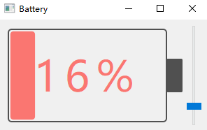
  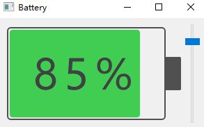
</div>

## [BatteryQuick](BatteryQuick/)--battery control(`QtQuick`）

## [Bootstarp](Bootstarp/)--Auto-start settings and detection when the program is powered on

1.  Reading and writing the registry under Windows enables self-starting at boot, and there are two locations where you can write;

    ```powershell
    HKEY_LOCAL_MACHINE\\SOFTWARE\\Microsoft\\Windows\\CurrentVersion\\Run //对于所有用户
    HKEY_CURRENT_USER\\SOFTWARE\\Microsoft\\Windows\\CurrentVersion\\Run // 对于当前用户
    ```

2.  Copy the plist file to ~/Library/LaunchAgents/ under MacOS, and use the launchctl load/unload command to achieve automatic startup at boot;

3.  There are two ways under Ubuntu:
    1.  Use the systemctl --user enable/disable command to achieve automatic startup at boot;
        1.  Copy the .service and .timer files to ~/.config/systemd/user/, and use the systemctl --user enable/disable command to implement automatic startup at boot;
        2.  The systemctl command is used in the .timer file, which is used to execute the .service file regularly to prevent the qxcbconnection: could not connect to display error from occurring after the graphical interface is started;
    2.  Copy the .desktop file under /usr/share/Application/ to ~/.config/autostart/ to achieve automatic startup at boot (not verified);

## [BubbleWindow](BubbleWindow/)——Bubble dialog box, which can also be used as a tool tip (ToolTip)

<div align="center">
  
</div>

## [Chart](Chart/)——Visual chart drawing, reference[Use QChart to display real-time dynamic curves](https://qtdebug.com/qtbook-paint-realtime-curve-qchart/ "qtdebug/公孙二狗")Examples related to QChart

<div align="center">
  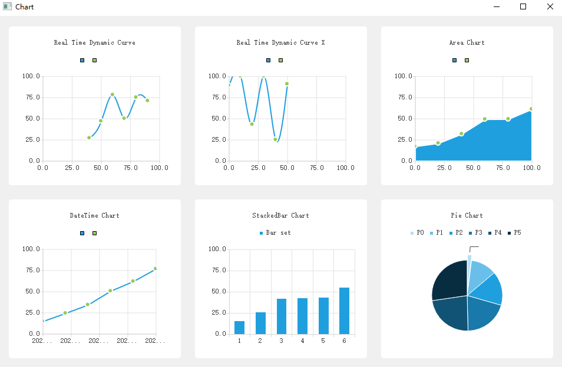
  <div style="text-align: center;">图一、二动态曲线</div>
  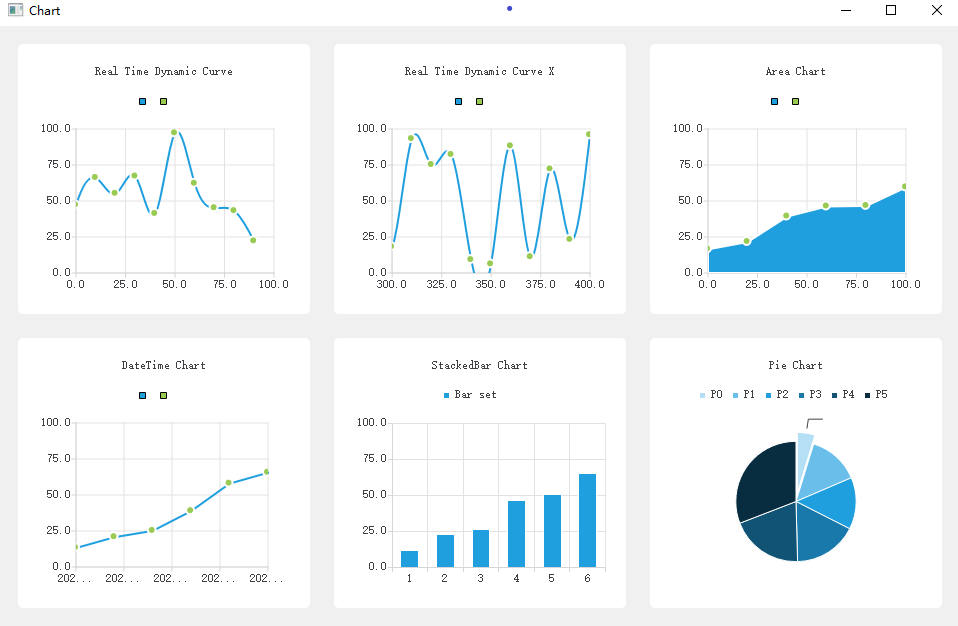
  <div style="text-align: center;">图二坐标轴也会滚动</div>
</div>

## [CheckBoxStandardItem](CheckBoxStandardItem/)——StandardItem that can be checked, and the parent node status or child node status is automatically updated according to the checked status

<div align="center">
  
</div>

## [Clock](Clock/)--clock

<div align="center">
  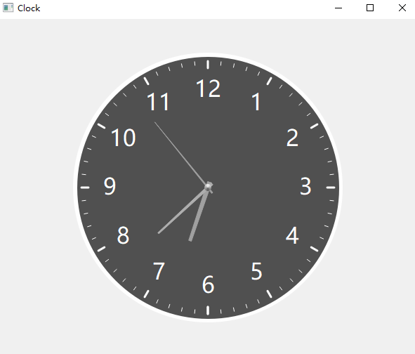
</div>

## [DashBoard](DashBoard/)——Dashboard

<div align="center">
  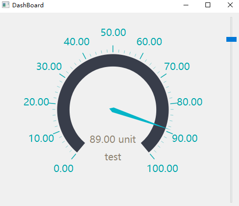
</div>

## [DragDrop](DragDrop/)——Simple control drag and drop, refer to the QT example Drag and Drop Puzzle Example

## [FlowLayout](FlowLayout/)——Flow layout, from QT example Flow Layout Example

<div align="center">
  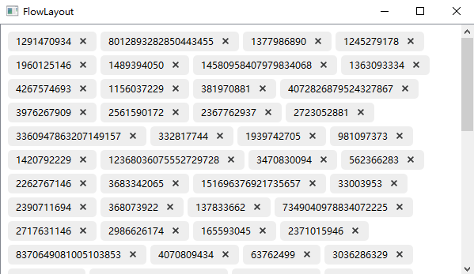
</div>

## [GridViewModel](GridViewModel/)——Adaptive palace chart based on QListView

<div align="center">
  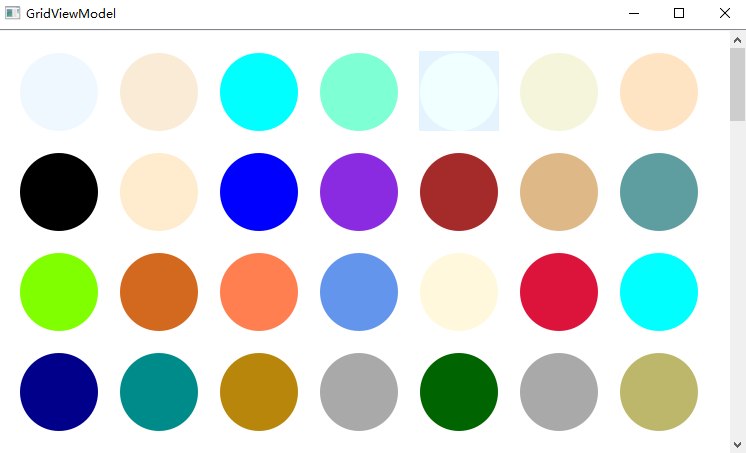
</div>

## [HttpClient](HttpClient/)——Simple HTTP client, supporting JSON requests and functions such as uploading, downloading, and deleting files

## [IconButton](IconButton/)——EventFilter and Button that support Icon following state switching

## [ImageCarousel](ImageCarousel/)——Simple picture carousel component

<div align="center">
  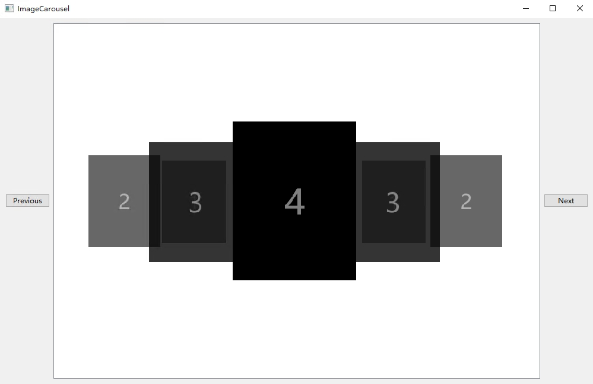
</div>

## [LoadingIndicator](LoadingIndicator/)——Loading indicator, supports gif animation

<div align="center">
  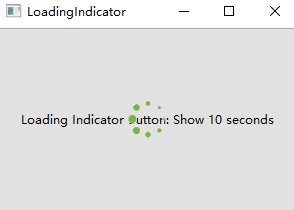
</div>

## [LogAsynchronous](LogAsynchronous/)——Asynchronous logging, create a thread to write logs to files, and separate the front and back ends

1.  Log file name: application name (appname). time (time, accurate to seconds). host name. process ID (Tid). log (. count). If a single log written in a day is close to 1G, a suffix will be added automatically. (.1,.2.3..., and so on) Create a new log file to write, and rollFile will still be rolled at 0 o'clock every day;
    1.  Normal file name: LogAsynchronous.2020-04-26-20-29-03.Youth.11828.log;
    2.  The log written on that day was close to 1G, and the new file name was: LogAsynchronous.2020-04-26-20-38-55.Youth.11828.log.1;
2.  Log format: time (time, accurate to milliseconds). Thread ID (Pid). Log level (debug). Print information (msg). File (File). Line number (Line).
    1.  For example: 2020-04-26 20:38:55.818 2052[Debug]123456789qwertyuioplkjhgfdsa 8412789-File:(..\\logAsynchronous\\main.cpp) Line:(19)；
3.  [Qt-App](https://github.com/RealChuan/Qt-App/blob/main/src/utils/logasync.h), this project also has log encapsulation, which is roughly consistent with the code of this project. Since the update frequency of the two projects may be different, it is recommended to check the log module at the same time.[Qt-App](https://github.com/RealChuan/Qt-App/blob/main/src/utils/logasync.h)latest updates.

## [MulClient](MulClient/)——Multi-threaded client, one client per thread (how to bypass system limitations and simulate millions of clients)

## [MulServer](MulServer/)——Multi-threaded server, one thread and one client processing (processing TCP communication with high real-time performance)

## [NavigationProgressBar](NavigationProgressBar/)——Navigation progress bar

<div align="center">
  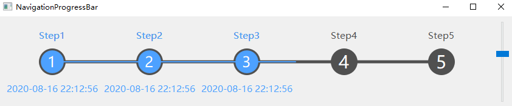
</div>

## [PasswordLineEdit](PasswordLineEdit/)——Password input box

<div align="center">
  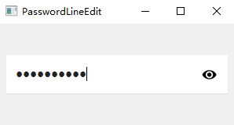
  
</div>

## [ProgressArc](ProgressArc/)——Arc progress bar

<div align="center">
  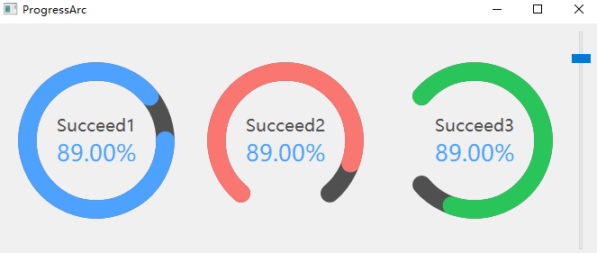
</div>

## [ProgressBar](ProgressBar/)——QProgressBar rounded corner alternative

<div align="center">
  
</div>

## [ReactorServer](ReactorServer/)——Multi-threaded server, Reactor mode (Echo)

## [SimpleUdp](SimpleUdp/)——Simple UDP example, broadcast and receive

## [ShowInMyComputer](ShowInMyComputer/)——Show current applications in My Computer

Firewall whitelist.

## [SlipButton](SlipButton/)——Sliding button

> Another: A simpler implementation:[Animated CheckBox](http://qtdebug.com/qtbook-animated-checkbox/)；

<div align="center">
  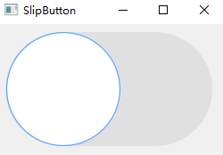
  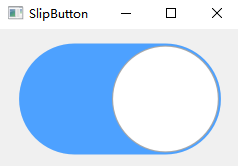
</div>

## [SqliteWAL](SqliteWAL/)——Multi-threaded concurrent writing database program in Sqlite WAL mode

1.  Each thread has an independent database connection (different connection name). When the thread exits, you need to actively remove the database connection, otherwise a large number of database connections will be generated;
2.  Under multi-threading, QMutex is still used to ensure thread safety. When reading, you can consider not using QMutex, and concurrent reading should have no impact (for writing, you can consider using QMutex);

### Advantages of WAL mode

1.  Improved concurrency: WAL mode allows multiple readers and one writer to access the database at the same time, which can improve concurrency performance;
2.  Crash recovery: WAL mode ensures that the database remains consistent in the event of a crash by flushing all changes to the log file before committing the transaction;

### Things to note about WAL mode

1.  WAL mode is only available in SQLite 3.35.5+ versions;
2.  Increased disk usage: WAL mode requires more disk space than rollback mode because it writes all changes to the log file before committing them;
3.  Slow read performance: Read operations are not blocked by write operations. If read and write operations are performed at the same time, data inconsistency may result.

## [TableViewModel](TableViewModel/)——Table view

1.  Various custom agents
    1.  [ButtonDelegate](./TableViewModel/buttondelegate.h)；
    2.  [ComboBoxDelegate](./TableViewModel/comboboxdelegate.h)；
    3.  [ProgressBarDelegate](./TableViewModel/progressbardelegate.h)；
    4.  [RichTextItemDelegate](./TableViewModel/richtextitemdelegate.hpp)；
    5.  [StarDelegate](./TableViewModel/stardelegate.h)----From Qt example Star Delegate Example;
2.  One hundred thousand level data rendering;

<div align="center">
  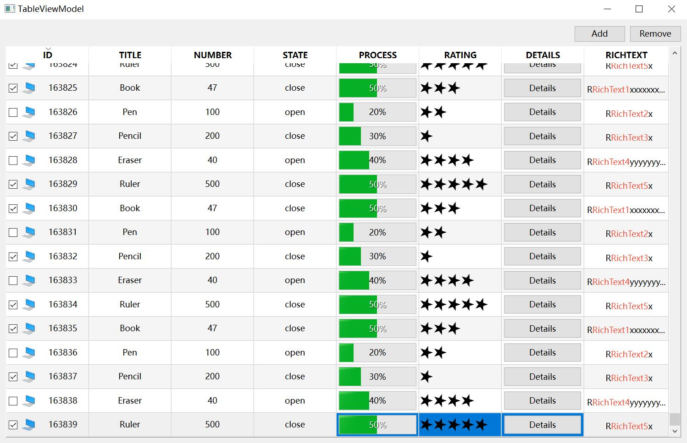
</div>

## [Thread](Thread/)——Multi-threading examples, 6 ways of writing

## [TreeViewModel](TreeViewModel/)——Tree view (MVC), QtCreator source code

<div align="center">
  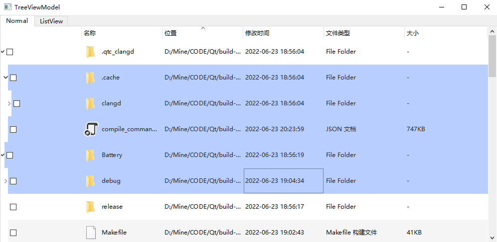
  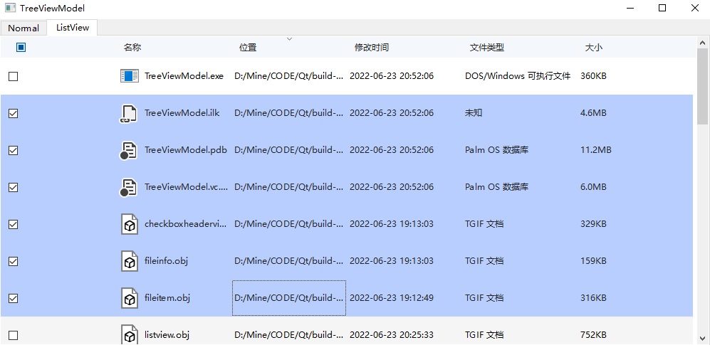
</div>

## [Validator](Validator/)——Enhanced versions of IntValidator (QIntValidator) and DoubleValidator (QDoubleValidator)

## [packaging](packaging/)——Packaging script

1.  [macos](packaging/macos/)
    1.  [`qmake`](packaging/macos/build.py)compile;
    2.  Package pkg and dmg packages and sign them (`python`/`appdmg`), for details, please refer to[Qt-App](https://github.com/RealChuan/Qt-App/tree/main/packaging/macos)；
2.  [ubuntu](packaging/ubuntu/)
    1.  [`qmake`](packaging/ubuntu/build.py)compile;
    2.  For packaging deb packages, please refer to[Qt-App](https://github.com/RealChuan/Qt-App/tree/main/packaging/ubuntu)；
3.  [windows](packaging/windows/)
    1.  [`qmake`](packaging/windows/build.py)compile;
    2.  [`signtool`](packaging/windows/sign.bat)sign;
    3.  Inno Setup packaging can be referred to[Qt-App](https://github.com/RealChuan/Qt-App/tree/main/packaging/windows), if you want to sign, you can put[sign.bat](packaging/windows/sign.bat)Copy the signature script in the Inno Setup tool`Tools`->`Configure Sign Tools`, then add sign flags after the required files;
