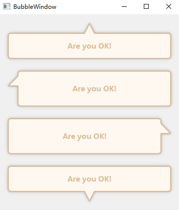
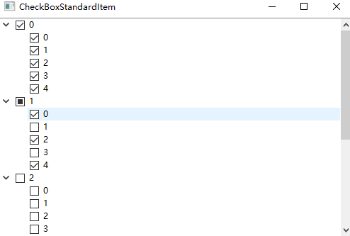
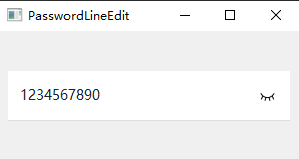
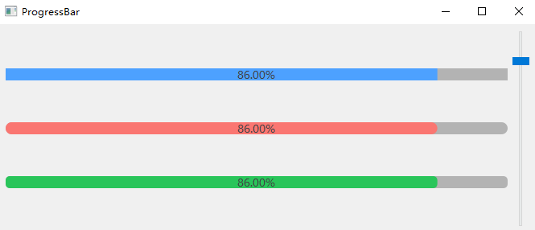
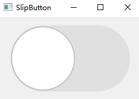

# Qt-Examples

-   [Simplified Chinese](README.md)
-   [English](README.en.md)

## Overview

This repository contains numerous Qt samples demonstrating everything from basic UI components to advanced network programming and system tools. Each example is self-contained and can be used as a reference or starting point for your own Qt projects.

## Example

### [Battery](src/Battery/)- Battery level indicator widget

-   Custom widget shows battery level with visual indicator
-   Support alarm and normal status
-   
    

### [BatteryQuick](src/BatteryQuick/)- Battery widget (QtQuick)

-   Battery indicator implemented using QtQuick

ok that's right`Bootstrap`Detailed description section of the example, which you can replace in the README.

### [Bootstrap](src/Bootstrap/)- Auto-start management at boot

Cross-platform self-starting management module supports Windows, macOS and Linux systems.

#### Core functions

-   **One-click settings**: Simple API to control the auto-start switch
-   **status detection**: Real-time detection of self-starting status
-   **Permission adaptation**: Automatically handle different platform permission requirements
-   **delayed start**: Solve Linux graphical interface dependency problem

#### Platform implementation

##### Windows

-   **user level**：`HKEY_CURRENT_USER\...\Run`(No administrator rights required)
-   **system level**：`HKEY_LOCAL_MACHINE\...\Run`(requires administrator rights)
-   pass`QSettings`Operation registry

##### macOS

-   LaunchAgent mechanism
-   plist file is configured to`~/Library/LaunchAgents/`
-   use`launchctl`Command management

##### Linux

-   **recommend**：systemd user service (`~/.config/systemd/user/`)
-   **alternative**: Desktop file starts automatically (`~/.config/autostart/`)
-   Support delayed startup to avoid graphical interface dependency issues

### [BubbleWindow](src/BubbleWindow/)- Bubble dialog/tooltip

-   Custom style bubble dialog box
-   Available as enhanced tooltips
-   

### [Chart](src/Chart/)- Data visualization charts (QtCharts module Desprecated)

-   Multiple chart types: area chart, line chart, pie chart, bar chart
-   Real-time dynamic charts
-   Custom callouts and tooltips
-   
    

### [CheckBoxStandardItem](src/CheckBoxStandardItem/)- Checkable tree items

-   Standard items with checkbox functionality
-   Automatic parent/child status synchronization
-   

### [Clock](src/Clock/)- Analog clock widget

-   Custom drawn analog clock
-   

### [DashBoard](src/DashBoard/)- Dashboard indicators

-   Custom dashboard indicator widget
-   

### [DragDrop](src/DragDrop/)- Drag and drop functionality implemented

-   Custom drag and drop functionality
-   Qt-based drag-and-drop puzzle example

### [FlowLayout](src/FlowLayout/)- Fluid layout container

-   Adaptive flow layout for dynamic content arrangement
-   

### [GridViewModel](src/GridViewModel/)- Adaptive grid view

-   Adaptive grid layout based on QListView
-   

### [HttpClient](src/HttpClient/)- HTTP client implementation

-   HTTP client supporting JSON requests
-   File upload/download function
-   Support DELETE requests

### [IconButton](src/IconButton/)- Status aware icon button

-   Button with status related icon
-   Event filter implementation

### [ImageCarousel](src/ImageCarousel/)- Image carousel component

-   Automatic image carousel
-   

### [LifecycleCallback](src/LifecycleCallback/)- Lifecycle aware callback wrapper

-   Supports objects managed by QObject, std::shared_ptr, and free functions, automatically invalidating callbacks when the object is destroyed to prevent dangling pointers and memory safety issues.

### [LoadingIndicator](src/LoadingIndicator/)- loading animation

-   Animated loading indicator
-   Support GIF animation
-   

### [LogAsynchronous](src/LogAsynchronous/)- Asynchronous logging system

A high-performance asynchronous log library that adopts the producer-consumer model to specifically solve the performance bottleneck problem of synchronous log writing in a multi-threaded environment.

#### Core features

-   **Separation of front and back ends**: The application thread only adds logs to the memory buffer, and the dedicated log thread is responsible for writing to disk
-   **Non-blocking design**: Writing log operations will not block the main thread of the application
-   **double roll strategy**: Supports automatic rolling of log files by file size (nearly 1GB) and by time (0:00 every day)

#### File naming convention

-   Format:`应用名.时间.主机名.进程ID.log[.序号]`
-   Example:
    -   `MyApp.2023-10-15-14-30-25.HOSTNAME.12345.log`(basic file)
    -   `MyApp.2023-10-15-14-30-25.HOSTNAME.12345.log.1`(rolling file)

#### Log format

结构化日志格式，包含丰富上下文信息：

    2023-10-15 14:30:25.918 28456 [Info] 用户登录成功 File:(main.cpp) Line:(42)

Contains timestamp (milliseconds), thread ID, log level, message content and source code location.

This module is related to[Log implementation in Qt-App project](https://github.com/RealChuan/Qt-App/blob/main/src/utils/logasync.h)Sharing the same design concept, it is recommended to refer to the two implementations to choose the most suitable version when integrating.

### [MulClient](src/MulClient/)- Multi-threaded TCP client

-   Multiple client connections
-   One thread per client architecture

### [MulServer](src/MulServer/)- Multi-threaded TCP server

-   Server implementation with one thread per client
-   Real-time TCP communication

### [NavigationProgressBar](src/NavigationProgressBar/)- Navigation progress bar

-   Step navigation component
-   

### [PasswordLineEdit](src/PasswordLineEdit/)- Password input field

-   Secure password entry
-   Toggle visibility
-   
    

### [ProgressArc](src/ProgressArc/)- Circular progress indicator

-   Arc progress visualization
-   

### [ProgressBar](src/ProgressBar/)- Rounded corner progress bar

-   Custom style progress bar
-   QProgressBar alternative
-   

### [ReactorServer](src/ReactorServer/)- Reactor mode server

-   Reactor design pattern implementation
-   Multi-threaded echo server

### [ShowInMyComputer](src/ShowInMyComputer/)- System integration

-   Show application in system location
-   Firewall whitelist

### [SimpleUdp](src/SimpleUdp/)- UDP communication

-   UDP broadcast and receive
-   Simple network communication example

### [SlipButton](src/SlipButton/)- Sliding toggle button

-   animated toggle switch
-   
    

### [SqliteWAL](src/SqliteWAL/)- SQLite write-ahead log

-   Multi-threaded SQLite database operations
-   WAL mode implementation
-   Thread-safe write operations

### [TableViewModel](src/TableViewModel/)- Advanced table view

-   Custom delegate: button, combo box, progress bar
-   Rich text rendering
-   Star Rating Delegation
-   High-performance data rendering (100,000+ rows)
-   

### [Thread](src/Thread/)- Multi-threading example

-   6 different ways to handle threads
-   QThread usage pattern

### [TreeViewModel](src/TreeViewModel/)- Tree and list views

-   MVC pattern implementation
-   Checkbox title view
-   File system-like tree structure
-   
    

### [Validator](src/Validator/)- Enhanced input validator

-   Improved IntValidator and DoubleValidator
-   Custom validation rules

### [packaging](src/packaging/)- Cross-platform packaging solutions

##### macOS packaging

-   **Reference implementation**:[Qt-App macOS packaging](https://github.com/RealChuan/Qt-App/tree/main/packaging/macos)
-   **core file**:
    -   **DMG package**:
        -   [create-dmg](https://github.com/sindresorhus/create-dmg): The simplest;
        -   [create-dmg](https://github.com/create-dmg/create-dmg):Bash script;
        -   [node-appdmg](https://github.com/LinusU/node-appdmg): json configuration file;
        -   [dmgbuild](https://pypi.org/project/dmgbuild/): Python script;
    -   [entitlements.plist](packaging/macos/entitlements.plist)- Application signing permissions profile
    -   [package.sh](src/packaging/macos/package.sh)- Main packaging script, including the signing process,[Qt-App macOS packaging](https://github.com/RealChuan/Qt-App/tree/main/packaging/macos)There is no signing process here
    -   [utils.sh](src/packaging/macos/utils.sh)- Packaging helper functions

##### Windows packaging

-   **Reference implementation**:[Qt-App Windows packaging](https://github.com/RealChuan/Qt-App/tree/main/packaging/windows)
-   **core file**:
    -   [sign.bat](src/packaging/windows/sign.bat)- Code signing script, supports integration into Inno Setup
-   **Signature integration**: Integrate the signing script in sign.bat into the Inno Setup tool:
    1.  Select in Inno Setup`Tools`→`Configure Sign Tools`
    2.  Add the signing tool and paste the script content in sign.bat
    3.  Add the corresponding sign flags parameter to the packaging script for the files that need to be signed.

##### Ubuntu 打包

-   **Reference implementation**:[Qt-App Ubuntu packaging](https://github.com/RealChuan/Qt-App/tree/main/packaging/ubuntu)

## resource

-   [Qt Practical Tips (Chinese)](https://realchuan.github.io/2021/10/12/QT实用小技巧（想到就更新）/)
-   [Use QChart to display real-time dynamic curves](https://qtdebug.com/qtbook-paint-realtime-curve-qchart/)
-   [SQLite WAL documentation](https://sqlite.org/wal.html)
