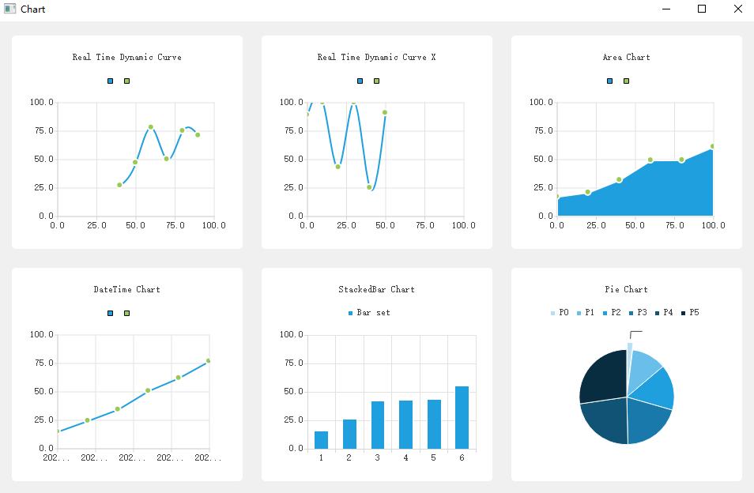

# Qt-Examples

-   [Simplified Chinese](README.md)
-   [English](README.en.md)

## Overview

This repository contains a rich collection of Qt sample projects, covering a variety of functions from basic UI components to advanced network programming and system tools. Each example is self-contained and can be used as a reference or starting point for development of your Qt projects.

## Sample project

### [AutoStartManager](src/AutoStartManager/)- Auto-start management at boot

-   **Windows**:User registration form`HKEY_CURRENT_USER\SOFTWARE\Microsoft\Windows\CurrentVersion\Run`, system registry`HKEY_LOCAL_MACHINE\...\Run`
-   **macOS**：`~/Library/LaunchAgents/com.{appname}.plist`
-   **Linux**：`~/.config/autostart/{appname}.desktop`

### [Battery](src/Battery/)-Battery power display control

-   Supports charging status display and lightning symbol
-   Low battery alarm threshold and color can be set
-   Support numerical animation transition effects

### [BatteryQuick](src/BatteryQuick/)- Battery level display control (QtQuick version)

### [Bubble](src/Bubble/)- Bubble dialog control

-   Support arrow positioning in four directions
-   Contains fade animation and shadow effects
-   Customizable borders, background colors and rounded corners

### [ButtonIconStateManager](src/ButtonIconStateManager/)- Button icon state manager

-   Smart management button icon switching in different states
-   Supports four states: normal, hover, pressed, and selected.
-   Automatic status detection based on event filters
-   Can be applied to QPushButton, QToolButton and other button types

### [Carousel3DView](src/Carousel3DView/)- 3D carousel control

-   Supports image carousel display with stereoscopic 3D effect
-   Customizable animation duration and automatic rotation interval
-   Automatic carousel is paused when the mouse is hovered and resumed when removed.
-   Support clicking on the picture to jump directly to the center location

### [Chart](src/Chart/)- Data visualization charts (QtCharts module)

-   Multiple chart types: area chart, line chart, pie chart, bar chart
-   Real-time dynamic charts
-   Custom callouts and tooltips

### [CheckableTreeItem](src/CheckableTreeItem/)- Hierarchical checkbox tree

-   The check box status of parent and child nodes is automatically linked
-   Support three-state display (selected/unselected/partially selected)
-   Contains file system tree structure demonstration

### [CircularProgress](src/CircularProgress/)- Circular progress bar control

-   Support arc progress display and percentage/numeric display
-   Customizable starting and ending angles
-   Supports animated transition effects and multiple color customizations
-   Provides rich signal and slot functions for status monitoring

### [CircularProgressQuick](src/CircularProgressQuick/)- Circular progress bar control (QtQuick version)

### [Clock](src/Clock/)- Analog clock control

-   Support second hand smooth animation effect
-   Customizable dial, scale, and pointer colors
-   Provides a variety of preset color themes

### [ClockQuick](src/ClockQuick/)- Analog clock control (QtQuick version)

### [DashBoard](src/DashBoard/)- Dashboard controls

-   Adjustable scale range and angle range
-   Support pointer numerical animation transition
-   Highly customizable colors and text styles

### [DashBoardQuick](src/DashBoardQuick/)- Dashboard control (QtQuick version)

### [FlowLayout](https://doc.qt.io/qt-6/qtwidgets-layouts-flowlayout-example.html)- Qt official Flow Layout Example

### [GridViewModel](src/GridViewModel/)- Adaptive grid layout

-   Grid layout component based on Qt Model-View architecture
-   Support adaptive column number and custom cells
-   Built-in multi-selection function and smooth interactive experience

### [HttpClient](src/HttpClient/)- HTTP client

-   Supports GET/POST/PUT/DELETE methods
-   File upload and download, supports breakpoint resume and progress callback
-   JSON request and response processing automatically
-   Timeout control and SSL certificate configuration

### [LifecycleCallback](src/LifecycleCallback/)- Lifecycle aware callback wrapper

-   Automatically detect object destruction and avoid dangling callbacks
-   Supports QObject, std::shared_ptr and free functions
-   Type safety, providing convenient creation of functions

### [LoadingIndicator](src/LoadingIndicator/)- Loading indicator control

-   Supports multiple animation styles: rotating dots, pulsing circles, jumping bars, custom GIF animations
-   Customizable text, color, background and animation speed
-   Provide overlay mode to easily achieve mask loading effect

### [LoadingIndicatorQuick](src/LoadingIndicatorQuick/)- Loading indicator control (QtQuick version)

### [LoadingOverlayQuick](src/LoadingOverlayQuick/)- Load overlay control (QtQuick version)

-   Lightweight loading overlay component based on QtQuick Popup
-   Use the system's native BusyIndicator to ensure platform consistency
-   Modal dialog box design to prevent user interaction

### [LogAsync](src/utils/logasync.h)- Asynchronous logging system

-   Independent thread handles log writing to avoid blocking the main thread
-   Supports console output, file recording or both at the same time
-   Automatically roll log files by size and time, support automatic cleaning of old files

### [NavigationProgressBar](src/NavigationProgressBar/)- Navigation progress bar control

-   Supports visual display of multi-step processes
-   Customizable color themes and font styles
-   Provide step forward, backward and reset functions

### [NavigationProgressBarQuick](src/NavigationProgressBarQuick/)- Navigation progress bar control (QtQuick version)

### [PasswordInputQuick](src/PasswordInputQuick/)- Password input box control (QtQuick version)

### [PasswordLineEdit](src/PasswordLineEdit/)- Password input box control

-   Support show/hide password switching function
-   Automatically detect CapsLock status and display warning prompts
-   Customizable icons, prompt duration and warning functions

### [ProgressBar](src/ProgressBar/)- Linear progress bar control

-   Supports animation transition effects and can customize the animation duration
-   Customizable fillet radius, supports automatic fillet calculation
-   Supports two display modes: percentage and numerical value

### [ReactorServer](src/ReactorServer/)- Multi-threaded Reactor mode TCP server

-   High-performance TCP server framework based on Reactor design pattern
-   Master-slave Reactor architecture: the main thread accepts connections and the worker thread handles I/O
-   Built-in thread pool and load balancing, automatically assign connections to idle threads

### [SqliteWAL](src/SqliteWAL/)- SQLite write-ahead log

-   Multi-threaded SQLite database operations
-   WAL mode implementation
-   Thread-safe write operations

### [SwitchButton](src/SwitchButton/)- Switch button control

-   Supports smooth switch animation transition effects
-   Customizable colors for selected and unselected states
-   Customizable slider color and border color

### [SwitchDelegate](https://doc.qt.io/qt-6/zh/qtquickcontrols-customize.html#customizing-switchdelegate)- Qt official switch button delegate (QtQuick version)

### [WindowsIntegration](src/WindowsIntegration/)- Windows "This PC" integration

-   **Windows**:registry`HKEY_CURRENT_USER\SOFTWARE\Classes\CLSID\{GUID}`and`HKEY_CURRENT_USER\SOFTWARE\Microsoft\Windows\CurrentVersion\Explorer\MyComputer\NameSpace\{GUID}`
-   **Function**: Adds an application icon to Windows This PC, displaying it alongside the disk drive

### [packaging](src/packaging/)- Cross-platform packaging solutions

#### macOS packaging

-   **Reference implementation**:[Qt-App macOS packaging](https://github.com/RealChuan/Qt-App/tree/main/packaging/macos)
-   **core file**:
    -   **DMG package**:
        -   [create-dmg](https://github.com/sindresorhus/create-dmg): The simplest;
        -   [create-dmg](https://github.com/create-dmg/create-dmg):Bash script;
        -   [node-appdmg](https://github.com/LinusU/node-appdmg): json configuration file;
        -   [dmgbuild](https://pypi.org/project/dmgbuild/): Python script;
    -   [entitlements.plist](packaging/macos/entitlements.plist)- Application signing permissions profile
    -   [package.sh](src/packaging/macos/package.sh)- Main packaging script, including the signing process,[Qt-App macOS packaging](https://github.com/RealChuan/Qt-App/tree/main/packaging/macos)There is no signing process here
    -   [utils.sh](src/packaging/macos/utils.sh)- Packaging helper functions

#### Windows packaging

-   **Reference implementation**:[Qt-App Windows packaging](https://github.com/RealChuan/Qt-App/tree/main/packaging/windows)
-   **core file**:
    -   [sign.bat](src/packaging/windows/sign.bat)- Code signing script, supports integration into Inno Setup
-   **Signature integration**: Integrate the signing script in sign.bat into the Inno Setup tool:
    1.  Select in Inno Setup`Tools`→`Configure Sign Tools`
    2.  Add the signing tool and paste the script content in sign.bat
    3.  Add the corresponding sign flags parameter to the packaging script for the files that need to be signed.

#### Ubuntu packaging

-   **Reference implementation**:[Qt-App Ubuntu packaging](https://github.com/RealChuan/Qt-App/tree/main/packaging/ubuntu)

## resource

-   [Qt Practical Tips (Chinese)](https://realchuan.github.io/2021/10/12/QT实用小技巧（想到就更新）/)
-   [Use QChart to display real-time dynamic curves](https://qtdebug.com/qtbook-paint-realtime-curve-qchart/)
-   [SQLite WAL documentation](https://sqlite.org/wal.html)
