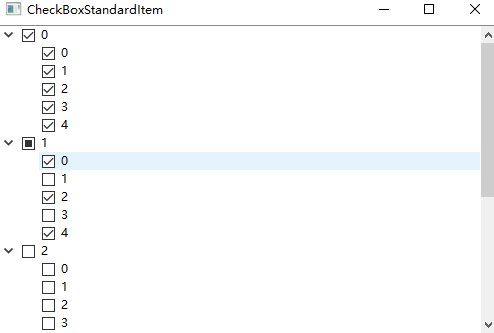
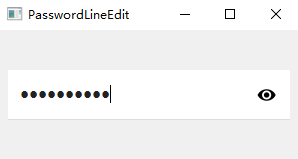
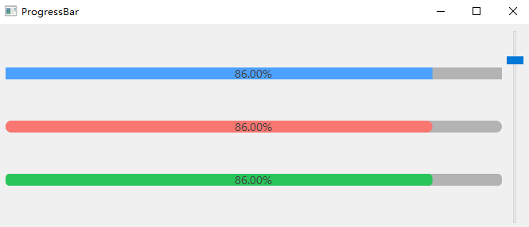
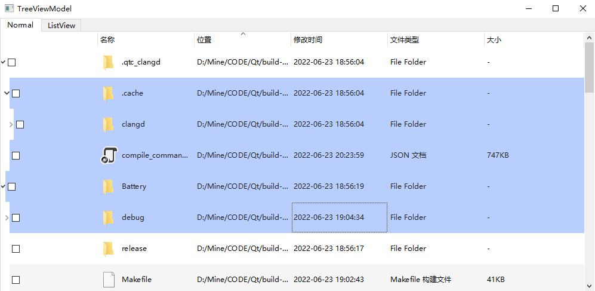

# Qt-Examples

-   [Simplified Chinese](README.md)
-   [English](README.en.md)

## Overview

This repository contains numerous Qt examples that showcase everything from basic UI components to advanced network programming and system tools. Each example is self-contained and can be used as a reference or starting point for your own Qt project.

## Example

### [Battery](Battery/)- Battery Level Indicator Widget

-   Custom widgets display battery power with visual indicator
-   Supports alarm and normal state
-   
    

### [BatteryQuick](BatteryQuick/)- Battery widget (QtQuick)

-   Battery indicator implemented with QtQuick

OK, this is right`Bootstrap`The detailed description section of the example, which you can replace in README.

### [Bootstrap](Bootstrap/)- Power-on self-start management

Cross-platform boot self-boot management module, supporting Windows, macOS and Linux systems.

#### Core functions

-   **One-click setting**: Simple API control self-start switch
-   **Status detection**: Real-time self-start status detection
-   **Permission adaptation**: Automatically handle permission requirements for different platforms
-   **Delayed startup**: Solve the dependency problem of Linux graphical interface

#### Platform implementation

##### Windows

-   **User level**：`HKEY_CURRENT_USER\...\Run`(No administrator permission required)
-   **System level**：`HKEY_LOCAL_MACHINE\...\Run`(Administrator permission required)
-   pass`QSettings`Operation registry

##### macOS

-   LaunchAgent mechanism
-   plist file configuration to`~/Library/LaunchAgents/`
-   use`launchctl`Command Management

##### Linux

-   **recommend**：systemd user service (`~/.config/systemd/user/`)
-   **Alternative**: Desktop file self-start (`~/.config/autostart/`)
-   Support delayed startup to avoid graphical interface dependency problems

### [BubbleWindow](BubbleWindow/)- Bubble Dialog Box/Tool Tips

-   Custom style bubble dialog box
-   Can be used as an enhanced tooltip
-   

### [Chart](Chart/)- Data visualization chart

-   Various chart types: area chart, line chart, pie chart, bar chart
-   Real-time dynamic charts
-   Custom annotations and tooltips
-   
    

### [CheckBoxStandardItem](CheckBoxStandardItem/)- Checkable tree items

-   Standard items with checkbox function
-   Automatic parent/child state synchronization
-   

### [Clock](Clock/)- Analog clock widget

-   Custom drawn analog clock
-   

### [DashBoard](DashBoard/)- Dashboard indicator

-   Custom dashboard indicator widget
-   

### [DragDrop](DragDrop/)- Drag and drop function implementation

-   Custom drag and drop function
-   Qt-based drag-and-drop puzzle example

### [FlowLayout](FlowLayout/)- Streaming layout container

-   Adaptive streaming layout for dynamic content arrangement
-   

### [GridViewModel](GridViewModel/)- Adaptive grid view

-   Adaptive grid layout based on QListView
-   

### [HttpClient](HttpClient/)- HTTP client implementation

-   HTTP clients that support JSON requests
-   File upload/download function
-   Support DELETE requests

### [IconButton](IconButton/)- Status Aware Icon Button

-   Button with status-related icons
-   Event filter implementation

### [ImageCarousel](ImageCarousel/)- Picture carousel component

-   Automatic picture carousel
-   

### [LoadingIndicator](LoadingIndicator/)- Loading animation

-   Animation loading indicator
-   Supports GIF animations
-   

### [LogAsynchronous](LogAsynchronous/)- Asynchronous logging system

A high-performance asynchronous log library adopts a producer-consumer model and specifically solves the performance bottleneck problem of synchronous log writing in multi-threaded environments.

#### Core features

-   **Front and back end separation**: The application thread only adds logs to the memory buffer, and the dedicated log thread is responsible for writing to disk
-   **Non-blocking design**: The log writing operation will not block the main thread of the application
-   **Double scrolling strategy**: Supports automatic scrolling of log files by file size (near 1GB) and by time (zero every day)

#### File naming specifications

-   Format:`应用名.时间.主机名.进程ID.log[.序号]`
-   Example:
    -   `MyApp.2023-10-15-14-30-25.HOSTNAME.12345.log`(Basic Document)
    -   `MyApp.2023-10-15-14-30-25.HOSTNAME.12345.log.1`(Scrolling file)

#### Log format

Structured log format, containing rich context information:

    2023-10-15 14:30:25.918 28456 [Info] 用户登录成功 File:(main.cpp) Line:(42)

Contains timestamp (milliseconds), thread ID, log level, message content, and source code location.

This module and[Log implementation in Qt-App project](https://github.com/RealChuan/Qt-App/blob/main/src/utils/logasync.h)Share the same design concept, it is recommended to refer to the two implementations to choose the most suitable version when integrating.

### [MulClient](MulClient/)- Multithreaded TCP client

-   Multi-client connection
-   One thread architecture per client

### [MulServer](MulServer/)- Multithreaded TCP server

-   One thread per client server implementation
-   Real-time TCP communication

### [NavigationProgressBar](NavigationProgressBar/)- Navigation progress bar

-   Step Navigation Component
-   

### [PasswordLineEdit](PasswordLineEdit/)- Password input field

-   Secure password input
-   Switch visibility
-   
    

### [ProgressArc](ProgressArc/)- Circular progress indicator

-   Arc progress visualization
-   

### [ProgressBar](ProgressBar/)- Round corner progress bar

-   Custom style progress bar
-   QProgressBar Alternatives
-   

### [ReactorServer](ReactorServer/)- Reactor Mode Server

-   Reactor design pattern implementation
-   Multithreaded echo server

### [ShowInMyComputer](ShowInMyComputer/)- System Integration

-   Show application in system location
-   Firewall whitelist

### [SimpleUdp](SimpleUdp/)- UDP Communication

-   UDP broadcast and reception
-   Simple network communication example

### [SlipButton](SlipButton/)- Slide toggle button

-   Animation switch
-   
    

### [SqliteWAL](SqliteWAL/)- SQLite pre-write log

-   Multithreaded SQLite database operations
-   WAL mode implementation
-   Thread-safe write operation

### [TableViewModel](TableViewModel/)- Advanced Table View

-   Custom delegate: buttons, combo boxes, progress bars
-   Rich text rendering
-   Star rating commission
-   High-performance data rendering (100,000+ rows)
-   

### [Thread](Thread/)- Multithreaded Example

-   6 different thread processing methods
-   QThread usage mode

### [TreeViewModel](TreeViewModel/)- Tree and List View

-   MVC mode implementation
-   Checkbox title view
-   Tree structure of file system
-   
    

### [Validator](Validator/)- Enhanced Input Verifier

-   Improved IntValidator and DoubleValidator
-   Custom verification rules

### [packaging](packaging/)- Cross-platform packaging solution

##### macOS package

-   **Reference implementation**:[Qt-App macOS Packaging](https://github.com/RealChuan/Qt-App/tree/main/packaging/macos)
-   **Core files**:
    -   **DMG Packaging**:
        -   [create-dmg](https://github.com/sindresorhus/create-dmg): The easiest;
        -   [create-dmg](https://github.com/create-dmg/create-dmg):Bash script;
        -   [node-appdmg](https://github.com/LinusU/node-appdmg): json configuration file;
        -   [dmgbuild](https://pypi.org/project/dmgbuild/): Python script;
    -   [entitlements.plist](packaging/macos/entitlements.plist)- Application Signature Permission Configuration File
    -   [package.sh](packaging/macos/package.sh) - 主要打包脚本，这里包含签名过程，[Qt-App macOS Packaging](https://github.com/RealChuan/Qt-App/tree/main/packaging/macos)There is no signing process here
    -   [utils.sh](packaging/macos/utils.sh)- Package auxiliary functions

##### Windows Packaging

-   **Reference implementation**:[Qt-App Windows Packaging](https://github.com/RealChuan/Qt-App/tree/main/packaging/windows)
-   **Core files**:
    -   [sign.bat](packaging/windows/sign.bat)- Code signing scripts that support integration into Inno Setup
-   **Signature integration**: Integrate the signature scripts in sign.bat into the Inno Setup tool:
    1.  Select in Inno Setup`Tools`→`Configure Sign Tools`
    2.  Add a signature tool and paste the script content in sign.bat
    3.  Add the corresponding sign flags parameter to the file that needs to be signed in the package script

##### Ubuntu Packaging

-   **Reference implementation**:[Qt-App Ubuntu Packaging](https://github.com/RealChuan/Qt-App/tree/main/packaging/ubuntu)

## resource

-   [Qt Practical Tips (Chinese)](https://realchuan.github.io/2021/10/12/QT实用小技巧（想到就更新）/)
-   [Use QChart to display real-time dynamic curves](https://qtdebug.com/qtbook-paint-realtime-curve-qchart/)
-   [SQLite WAL Documentation](https://sqlite.org/wal.html)
