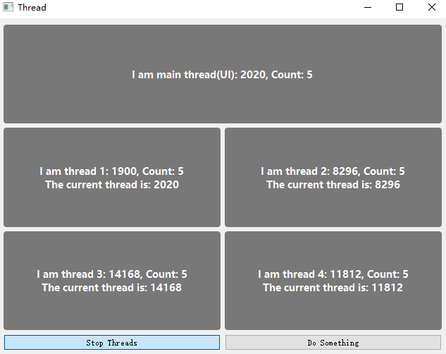

# Qt的一些简单常用示例     
1. [Battery](Battery/)-----------------电池；  
<table>
    <tr>
        <td >

</td >
        <td >

</td>
    </tr>
</table>

2. [BubbleWindow](BubbleWindow/)-----------------气泡式对话框，也可作工具提示（ToolTip）；  
<table>
    <tr>
        <td >
Bubble Window
</td >
        <td >
Bubble Tip
</td>
    </tr>
</table>

2. [Chart](Chart/)-----------------可视化图表绘制，参考[ 使用 QChart 显示实时动态曲线 ](https://qtdebug.com/qtbook-paint-realtime-curve-qchart/ "qtdebug/公孙二狗") 和QChart相关示例；  

   
图一二是动态曲线
  
   
图一二是动态曲线， 图二坐标轴也会动态变化
  

3. [Clock](/Clock)-----------------时钟；  

    

  

4. [DashBoard](/DashBoard)-----------------仪表盘；  

    

5. [DragDrop](DragDrop/)-----------------简单控件拖拽，参考QT示例Drag and Drop Puzzle Example； 

6. [HttpClient ](/HttpClient)-----------------http客户端；

7. [LogAsynchronous](LogAsynchronous/)-----------------异步日志，开辟一个线程专门往文件里写日志，前后端分离。  

   1. 日志文件名：应用程序名（appname）.时间(time,精确到秒).主机hostname.进程ID（Tid）.log（.count），假如一天内写的单个日志大约接近1G，会自动加后缀（.1,.2.3...，以此类推）新建新的日志文件去写，每天0点依然会rollFile；  
      1. 正常文件名：LogAsynchronous.2020-04-26-20-29-03.Youth.11828.log；  
      2. 当日写日志接近1G，新建的文件名：LogAsynchronous.2020-04-26-20-38-55.Youth.11828.log.1；  
   2. 日志格式：时间（time，精确到毫秒）.线程ID（Pid）.日志级别（debug）.打印信息（msg）.文件（File）.行号（Line）。  
   1. 比如：2020-04-26 20:38:55.818 2052 [Debug] 123456789qwertyuioplkjhgfdsa 8412789-File:(..\logAsynchronous\main.cpp) Line:(19)；  

8. [MulClient](MulClient/)-----------------多线程客户端，一个线程一个客户端（怎么可以绕开系统限制，模拟百万个客户端）；  

9. [MulServer](MulServer/)-----------------多线程服务端，一个线程一个客户端处理（处理实时性很高的TCP通讯）；  

10. [NavigationProgressBar](/NavigationProgressBar)-----------------导航进度栏;  

    

  

11. [ProgressArc](ProgressArc/)-----------------圆弧进度条；  

     

  

12. [ReactorServer](ReactorServer/)-----------------多线程服务端，Reactor模式（Echo），TcpServer类作为mainReactor（Accepter），每个Thread里跑一个Subreactor，建立相应的信号槽，负载均衡使用轮询法（Round-Robin），由于Qt的事件循环机制和信号槽机制，可省去很多回调函数的写法（其实就是使用信号槽替代）；  

13. [SqlTabview](SqlTabview/)-----------------SQLite数据库调用，模型方法；  

14. [SlipButton](SlipButton/)-----------------滑动按钮；  

     另：更简单的实现：[有动画效果的 CheckBox](http://qtdebug.com/qtbook-animated-checkbox/)；  

      <table>
          <tr>
              <td >

</td >
              <td >

</td>
          </tr>
      </table>  

15. [TabViewModel](TabViewModel/)-----------------表格视图（MVC）；   

16. [Thread](Thread/)-----------------多线程例子，四种写法，控件更新在子线程；  

      

  

17. [TreeViewModel](TreeViewModel/)-----------------树形视图（MVC），QtCreator源码；  

