# Qt-Examples

- [简体中文](README.md)
- [English](README.en.md)

## 概述

这个仓库包含众多 Qt 示例，展示了从基础 UI 组件到高级网络编程和系统工具的各种功能。每个示例都是自包含的，可以作为您自己 Qt 项目的参考或起点。

## 示例

### [Battery](src/Battery/) - 电池电量指示器小部件

- 自定义小部件显示电池电量，带有视觉指示器
- 支持报警和正常状态
- 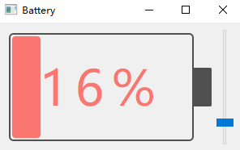
  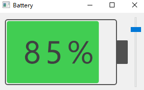

### [BatteryQuick](src/BatteryQuick/) - 电池小部件 (QtQuick)

- 使用 QtQuick 实现的电池指示器

好的，这是对 `Bootstrap` 示例的详细说明部分，您可以将其替换到 README 中。

### [Bootstrap](src/Bootstrap/) - 开机自启动管理

跨平台的开机自启动管理模块，支持 Windows、macOS 和 Linux 系统。

#### 核心功能

- **一键设置**：简单 API 控制自启动开关
- **状态检测**：实时检测自启动状态
- **权限适配**：自动处理不同平台权限要求
- **延迟启动**：解决 Linux 图形界面依赖问题

#### 平台实现

##### Windows

- **用户级**：`HKEY_CURRENT_USER\...\Run` (无需管理员权限)
- **系统级**：`HKEY_LOCAL_MACHINE\...\Run` (需要管理员权限)
- 通过 `QSettings` 操作注册表

##### macOS

- LaunchAgent 机制
- plist 文件配置到 `~/Library/LaunchAgents/`
- 使用 `launchctl` 命令管理

##### Linux

- **推荐**：systemd user service (`~/.config/systemd/user/`)
- **备选**：Desktop 文件自启动 (`~/.config/autostart/`)
- 支持延迟启动避免图形界面依赖问题

### [BubbleWindow](src/BubbleWindow/) - 气泡式对话框/工具提示

- 自定义样式气泡对话框
- 可用作增强型工具提示
- 

### [Chart](src/Chart/) - 数据可视化图表(QtCharts 模块 Desprecated)

- 多种图表类型：面积图、折线图、饼图、柱状图
- 实时动态图表
- 自定义标注和工具提示
- 
  

### [CheckBoxStandardItem](src/CheckBoxStandardItem/) - 可勾选的树形项

- 带复选框功能的标准项
- 自动父/子状态同步
- 

### [Clock](src/Clock/) - 模拟时钟小部件

- 自定义绘制的模拟时钟
- 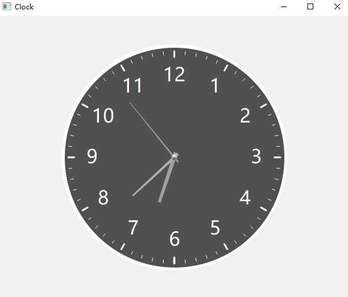

### [DashBoard](src/DashBoard/) - 仪表盘指示器

- 自定义仪表盘指示器小部件
- 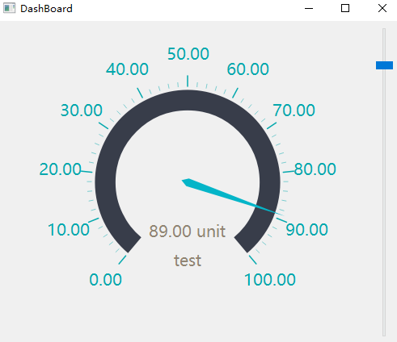

### [DragDrop](src/DragDrop/) - 拖放功能实现

- 自定义拖放功能
- 基于 Qt 的拖放拼图示例

### [FlowLayout](src/FlowLayout/) - 流式布局容器

- 自适应流式布局，用于动态内容排列
- 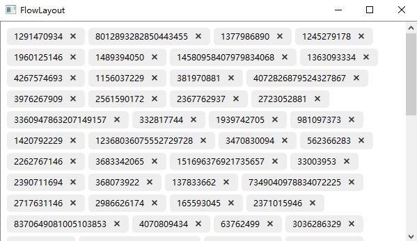

### [GridViewModel](src/GridViewModel/) - 自适应网格视图

- 基于 QListView 的自适应网格布局
- 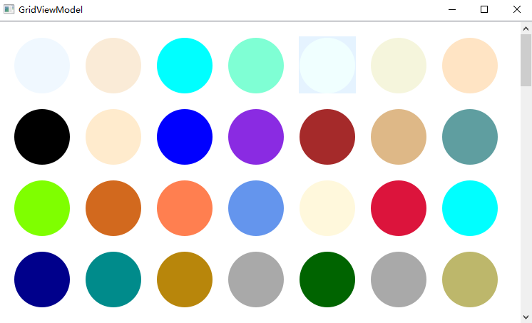

### [HttpClient](src/HttpClient/) - HTTP 客户端实现

- 支持 JSON 请求的 HTTP 客户端
- 文件上传/下载功能
- 支持 DELETE 请求

### [IconButton](src/IconButton/) - 状态感知图标按钮

- 具有状态相关图标的按钮
- 事件过滤器实现

### [ImageCarousel](src/ImageCarousel/) - 图片轮播组件

- 自动图片轮播
- 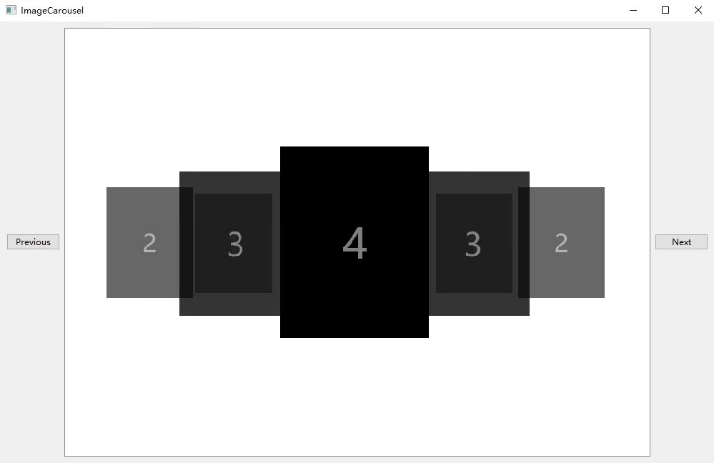

### [LifecycleCallback](src/LifecycleCallback/) - 生命周期感知的回调包装器

- 支持 QObject、std::shared_ptr 管理的对象以及自由函数，在对象被销毁时自动使回调无效，防止悬空指针和内存安全问题。

### [LoadingIndicator](src/LoadingIndicator/) - 加载动画

- 动画加载指示器
- 支持 GIF 动画
- 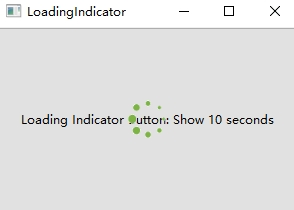

### [LogAsynchronous](src/LogAsynchronous/) - 异步日志系统

一个高性能的异步日志库，采用生产者-消费者模型，专门解决多线程环境下同步写日志的性能瓶颈问题。

#### 核心特性

- **前后端分离**：应用程序线程只将日志添加到内存缓冲区，专用日志线程负责写入磁盘
- **无阻塞设计**：写日志操作不会阻塞应用程序主线程
- **双滚动策略**：支持按文件大小（接近1GB）和按时间（每日零点）自动滚动日志文件

#### 文件命名规范

- 格式：`应用名.时间.主机名.进程ID.log[.序号]`
- 示例：
  - `MyApp.2023-10-15-14-30-25.HOSTNAME.12345.log` (基础文件)
  - `MyApp.2023-10-15-14-30-25.HOSTNAME.12345.log.1` (滚动文件)

#### 日志格式

结构化日志格式，包含丰富上下文信息：

```
2023-10-15 14:30:25.918 28456 [Info] 用户登录成功 File:(main.cpp) Line:(42)
```

包含时间戳(毫秒)、线程ID、日志级别、消息内容和源代码位置。

此模块与[Qt-App项目中的日志实现](https://github.com/RealChuan/Qt-App/blob/main/src/utils/logasync.h)共享相同设计理念，建议集成时参考两个实现选择最适合的版本。

### [MulClient](src/MulClient/) - 多线程 TCP 客户端

- 多客户端连接
- 每个客户端一个线程的架构

### [MulServer](src/MulServer/) - 多线程 TCP 服务器

- 每个客户端一个线程的服务器实现
- 实时 TCP 通信

### [NavigationProgressBar](src/NavigationProgressBar/) - 导航进度条

- 步骤导航组件
- 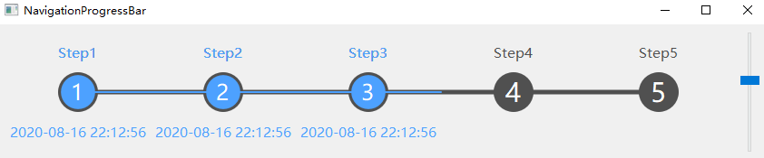

### [PasswordLineEdit](src/PasswordLineEdit/) - 密码输入字段

- 安全密码输入
- 切换可见性
- 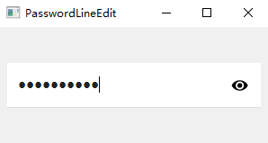
  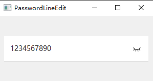

### [ProgressArc](src/ProgressArc/) - 圆形进度指示器

- 弧线式进度可视化
- 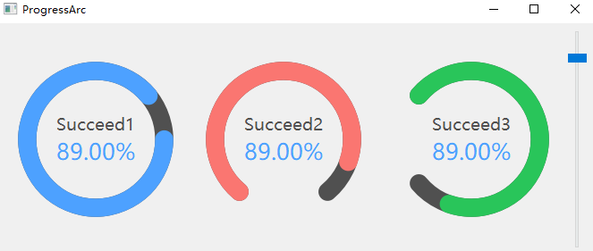

### [ProgressBar](src/ProgressBar/) - 圆角进度条

- 自定义样式进度条
- QProgressBar 替代方案
- 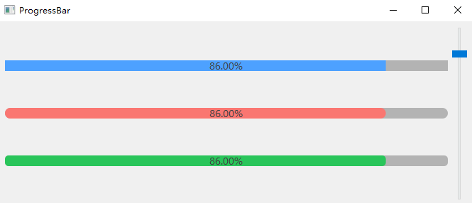

### [ReactorServer](src/ReactorServer/) - Reactor 模式服务器

- Reactor 设计模式实现
- 多线程回声服务器

### [ShowInMyComputer](src/ShowInMyComputer/) - 系统集成

- 在系统位置中显示应用程序
- 防火墙白名单

### [SimpleUdp](src/SimpleUdp/) - UDP 通信

- UDP 广播和接收
- 简单网络通信示例

### [SlipButton](src/SlipButton/) - 滑动切换按钮

- 动画切换开关
- 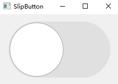
  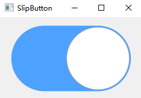

### [SqliteWAL](src/SqliteWAL/) - SQLite 预写式日志

- 多线程 SQLite 数据库操作
- WAL 模式实现
- 线程安全写入操作

### [TableViewModel](src/TableViewModel/) - 高级表格视图

- 自定义委托：按钮、组合框、进度条
- 富文本渲染
- 星级评分委托
- 高性能数据渲染（10万+行）
- 

### [Thread](src/Thread/) - 多线程示例

- 6 种不同的线程处理方法
- QThread 使用模式

### [TreeViewModel](src/TreeViewModel/) - 树形和列表视图

- MVC 模式实现
- 复选框标题视图
- 类文件系统的树形结构
- 
  

### [Validator](src/Validator/) - 增强型输入验证器

- 改进的 IntValidator 和 DoubleValidator
- 自定义验证规则

### [packaging](src/packaging/) - 跨平台打包解决方案

##### macOS 打包

- **参考实现**: [Qt-App macOS 打包](https://github.com/RealChuan/Qt-App/tree/main/packaging/macos)
- **核心文件**:
  - **DMG 打包**:
    - [create-dmg](https://github.com/sindresorhus/create-dmg)：最简单；
    - [create-dmg](https://github.com/create-dmg/create-dmg)：Bash 脚本；
    - [node-appdmg](https://github.com/LinusU/node-appdmg)：json 配置文件;
    - [dmgbuild](https://pypi.org/project/dmgbuild/)：Python 脚本;
  - [entitlements.plist](packaging/macos/entitlements.plist) - 应用程序签名权限配置文件
  - [package.sh](src/packaging/macos/package.sh) - 主要打包脚本，这里包含签名过程，[Qt-App macOS 打包](https://github.com/RealChuan/Qt-App/tree/main/packaging/macos)这里没有签名过程
  - [utils.sh](src/packaging/macos/utils.sh) - 打包辅助函数

##### Windows 打包

- **参考实现**: [Qt-App Windows 打包](https://github.com/RealChuan/Qt-App/tree/main/packaging/windows)
- **核心文件**:
  - [sign.bat](src/packaging/windows/sign.bat) - 代码签名脚本，支持集成到 Inno Setup
- **签名集成**: 将 sign.bat 中的签名脚本集成到 Inno Setup 工具：
  1. 在 Inno Setup 中选择 `Tools` → `Configure Sign Tools`
  2. 添加签名工具并粘贴 sign.bat 中的脚本内容
  3. 在打包脚本中为需要签名的文件添加对应的 sign flags 参数

##### Ubuntu 打包

- **参考实现**: [Qt-App Ubuntu 打包](https://github.com/RealChuan/Qt-App/tree/main/packaging/ubuntu)

## 资源

- [Qt 实用技巧（中文）](https://realchuan.github.io/2021/10/12/QT实用小技巧（想到就更新）/)
- [使用 QChart 显示实时动态曲线](https://qtdebug.com/qtbook-paint-realtime-curve-qchart/)
- [SQLite WAL 文档](https://sqlite.org/wal.html)
