# Qt的一些简单常用示例

- [简体中文](README.md)
- [English](README.en.md)

## [QT实用小技巧（想到就更新） | 自由意志 (realchuan.github.io)](https://realchuan.github.io/2021/10/12/QT%E5%AE%9E%E7%94%A8%E5%B0%8F%E6%8A%80%E5%B7%A7%EF%BC%88%E6%83%B3%E5%88%B0%E5%B0%B1%E6%9B%B4%E6%96%B0%EF%BC%89/)

## [Battery](Battery/)——电池；

<table>
    <tr>
        <td ><div align=center></div></td >
        <td ><div align=center></div></td>
    </tr>
</table>

## [Bootstarp](Bootstarp/)--程序开机自启动设置和检测;

1. Windows下读写注册表(HKEY_CURRENT_USER\\SOFTWARE\\Microsoft\\Windows\\CurrentVersion\\Run)实现开机自启动;
2. MacOS下拷贝plist文件到~/Library/LaunchAgents/，使用launchctl load/unload命令实现开机自启动;
3. Ubuntu下拷贝.service和.timer文件到~/.config/systemd/user/，使用systemctl --user enable/disable命令实现开机自启动;
   1. systemctl命令用于.timer文件,.timer文件用于定时执行.service文件，防止图形界面启动后，出现qxcbconnection: could not connect to display错误;
   2. 不需要定时执行的.service文件，可以直接使用systemctl --user enable/disable命令实现开机自启动;
   3. 也可以把/usr/share/Application/下的.desktop文件拷贝到~/.config/autostart/下，实现开机自启动（未验证）;

## [BubbleWindow](BubbleWindow/)——气泡式对话框，也可作工具提示（ToolTip）；

<div align=center>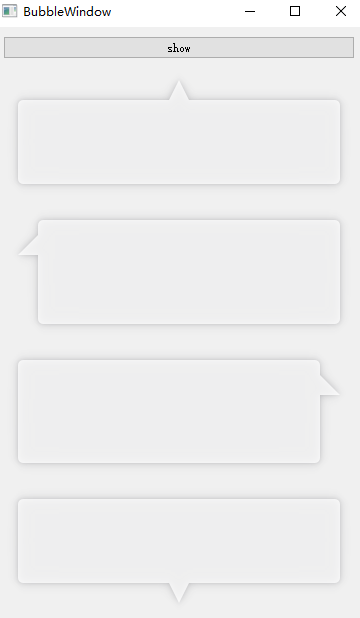</div>

## [Chart](Chart/)——可视化图表绘制，参考[ 使用 QChart 显示实时动态曲线 ](https://qtdebug.com/qtbook-paint-realtime-curve-qchart/ "qtdebug/公孙二狗") 和QChart相关示例；

<div align=center>图一二是动态曲线</div>  
<div align=center>图一二是动态曲线， 图二坐标轴也会动态变化</div>

## [CheckBoxStandardItem](/CheckBoxStandardItem)——可以勾选的StandardItem，而且根据勾选状态自动更新父节点状态或者子节点状态；

<div align=center>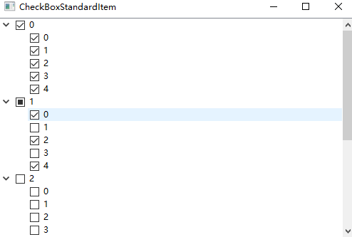</div>

## [Clock](/Clock)——时钟；

<div align=center></div>

## [DashBoard](/DashBoard)——仪表盘；

<div align=center>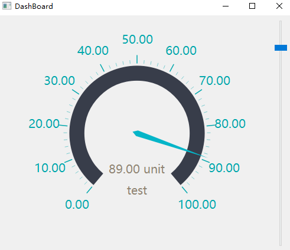</div>

## [FlowLayout](FlowLayout/)——流式布局，来自QT示例Flow Layout Example；

<div align=center>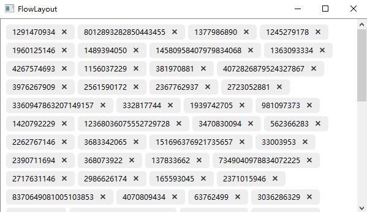</div>

## [DragDrop](DragDrop/)——简单控件拖拽，参考QT示例Drag and Drop Puzzle Example；

## [HttpClient ](/HttpClient)——http客户端；

## [ImageCarousel](ImageCarousel/)——简易图片轮播；

<div align=center>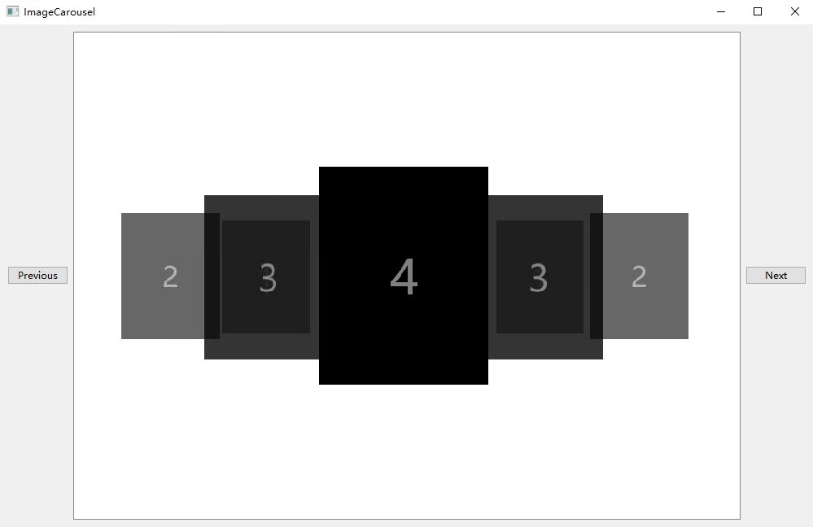</div>

## [GridViewModel ](/GridViewModel)——基于QListView的自适应宫图；

<div align=center>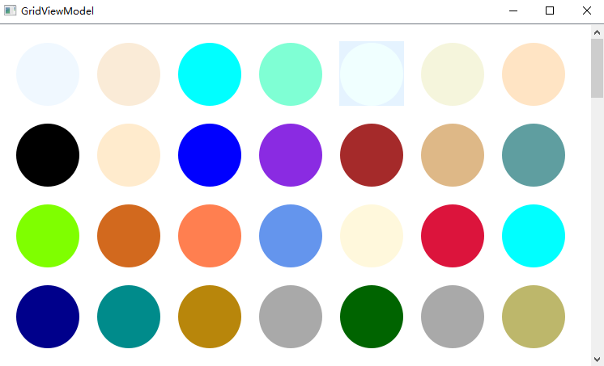</div>

## [LogAsynchronous](LogAsynchronous/)——异步日志，开辟一个线程专门往文件里写日志，前后端分离。

1. 日志文件名：应用程序名（appname）.时间(time,精确到秒).主机hostname.进程ID（Tid）.log（.count），假如一天内写的单个日志大约接近1G，会自动加后缀（.1,.2.3...，以此类推）新建新的日志文件去写，每天0点依然会rollFile；
   1. 正常文件名：LogAsynchronous.2020-04-26-20-29-03.Youth.11828.log；
   2. 当日写日志接近1G，新建的文件名：LogAsynchronous.2020-04-26-20-38-55.Youth.11828.log.1；
2. 日志格式：时间（time，精确到毫秒）.线程ID（Pid）.日志级别（debug）.打印信息（msg）.文件（File）.行号（Line）。
   1. 比如：2020-04-26 20:38:55.818 2052 [Debug] 123456789qwertyuioplkjhgfdsa 8412789-File:(..\logAsynchronous\main.cpp) Line:(19)；

## [MulClient](MulClient/)——多线程客户端，一个线程一个客户端（怎么可以绕开系统限制，模拟百万个客户端）；

## [MulServer](MulServer/)——多线程服务端，一个线程一个客户端处理（处理实时性很高的TCP通讯）；

## [NavigationProgressBar](/NavigationProgressBar)——导航进度栏;

<div align=center></div>

## [PasswordLineEdit](PasswordLineEdit/)——密码输入框；

<table>
    <tr>
        <td ><div align=center>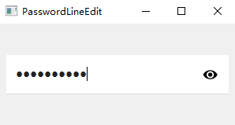</div></td >
        <td ><div align=center>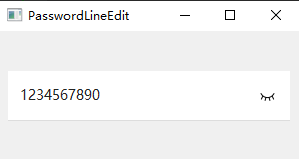</div></td>
    </tr>
</table>

## [ProgressArc](ProgressArc/)——圆弧进度条；

<div align=center>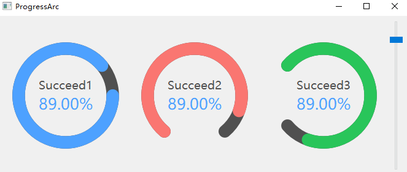</div>

## [ProgressBar](ProgressBar)——QProgressBar圆角替代方案；

<div align=center>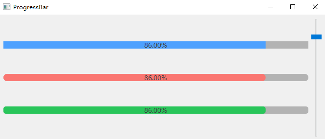</div>

## [ReactorServer](ReactorServer/)——多线程服务端，Reactor模式（Echo）；

## [SimpleUdp](SimpleUdp/)——简单UDP例子，广播和接收；

## [ShowInMyComputer](ShowInMyComputer/)——在我的电脑中显示当前应用程序；

防火墙白名单。

## [SlipButton](SlipButton/)——滑动按钮；

 另：更简单的实现：[有动画效果的 CheckBox](http://qtdebug.com/qtbook-animated-checkbox/)；

<table>
      <tr>
          <td ><div align=center>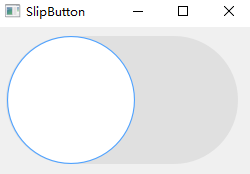</div></td >
          <td ><div align=center></div></td>
      </tr>
  </table>

## [SqlTabview](SqlTabview/)——SQLite数据库调用，模型方法；

## [TableViewModel](TableViewModel/)——表格视图；

1. 各种自定义代理
   1. [ButtonDelegate](./TableViewModel/buttondelegate.h)；
   2. [ComboBoxDelegate](./TableViewModel/comboboxdelegate.h)；
   3. [ProgressBarDelegate](./TableViewModel/progressbardelegate.h)；
   4. [RichTextItemDelegate](./TableViewModel/richtextitemdelegate.hpp)；
   5. [StarDelegate](./TableViewModel/stardelegate.h)----来自Qt示例Star Delegate Example；
2. 十万级数据渲染；

<div align=center>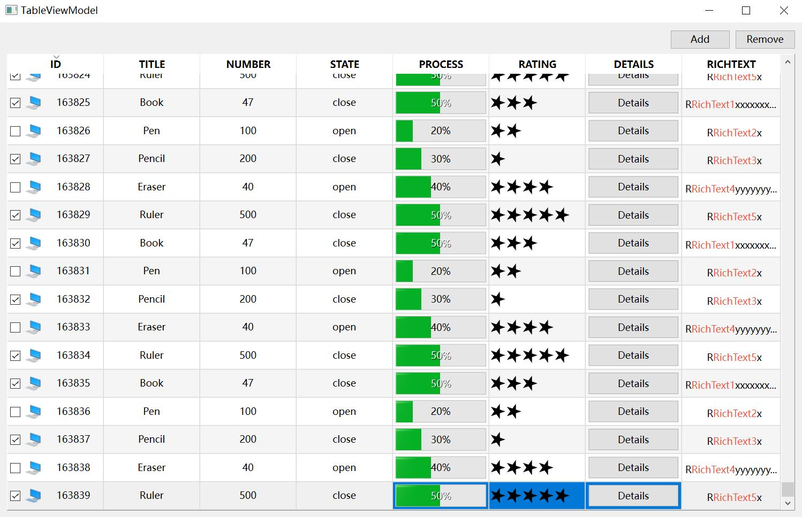</div>

## [Thread](Thread/)——多线程例子，6种写法；

## [TreeViewModel](TreeViewModel/)——树形视图（MVC），QtCreator源码；

<div align=center>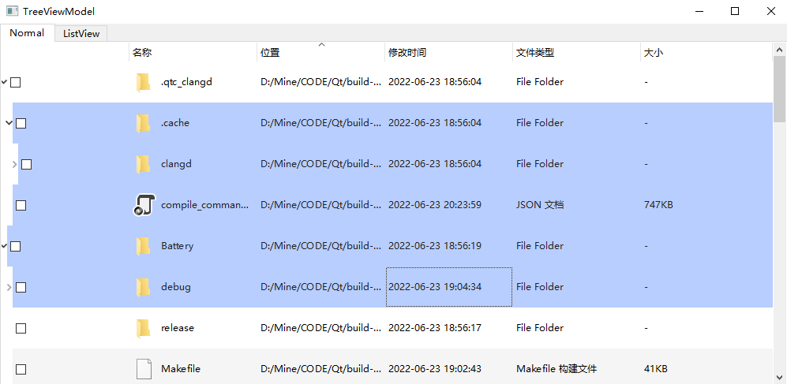</div>  
<div align=center>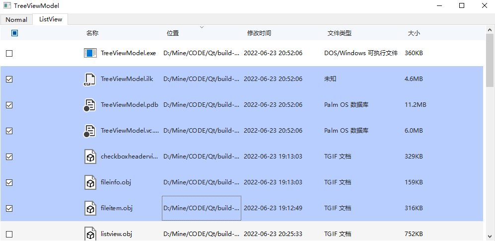</div>

## [Validator](Validator/)——加强版IntValidator（QIntValidator）和DoubleValidator（QDoubleValidator）

## [Scripts](Scripts/)——打包脚本

1. [macos](Scripts/macos/)——macos 通用编译打dmg包脚本（`python`/`dmgbuild`）；
2. [widnows](Scripts/windows)——windows 通用编译打包安装脚本（Innosetup）；

   1. `Innosetup` `signtool`

      ```
      sha256="C:\\Program Files (x86)\\Windows Kits\\10\\bin\\10.0.18362.0\\x86\\signtool.exe" sign /f C:\\work\\certificate\\xxxxx.pfx /p password /fd SHA256 /tr http://timestamp.digicert.com/scripts/timestamp.dll /td SHA256 $f
      ```
