# Qt-Examples

- [简体中文](README.md)
- [English](README.en.md)

## 概述

这个仓库包含众多 Qt 示例，展示了从基础 UI 组件到高级网络编程和系统工具的各种功能。每个示例都是自包含的，可以作为您自己 Qt 项目的参考或起点。

## 示例

### [AutoStartManager](src/AutoStartManager/) - 开机自启动

- **Windows**：用户注册表 `HKEY_CURRENT_USER\SOFTWARE\Microsoft\Windows\CurrentVersion\Run`，系统注册表 `HKEY_LOCAL_MACHINE\...\Run`
- **macOS**：`~/Library/LaunchAgents/com.{appname}.plist`
- **Linux**：`~/.config/autostart/{appname}.desktop`
- 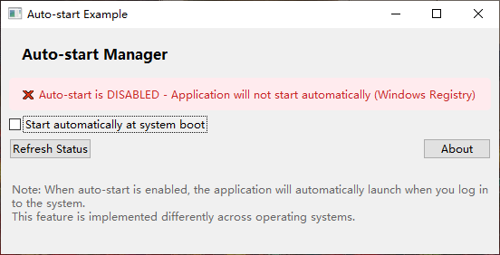

### [Battery](src/Battery/) - 电池电量显示控件

- 支持充电状态显示和闪电符号
- 可设置低电量报警阈值和颜色
- 支持数值动画过渡效果
- 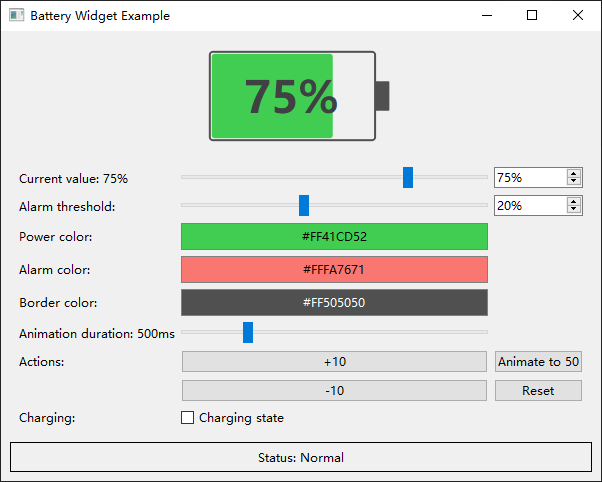

### [BatteryQuick](src/BatteryQuick/) - 电池电量显示控件 (QtQuick版本)

- 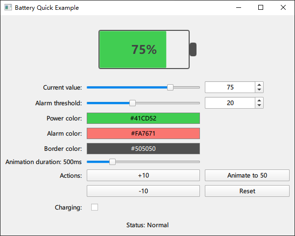

### [Bubble](src/Bubble/) - 气泡对话框控件

- 支持四个方向的箭头定位
- 包含淡入淡出动画和阴影效果
- 可自定义边框、背景颜色和圆角
- 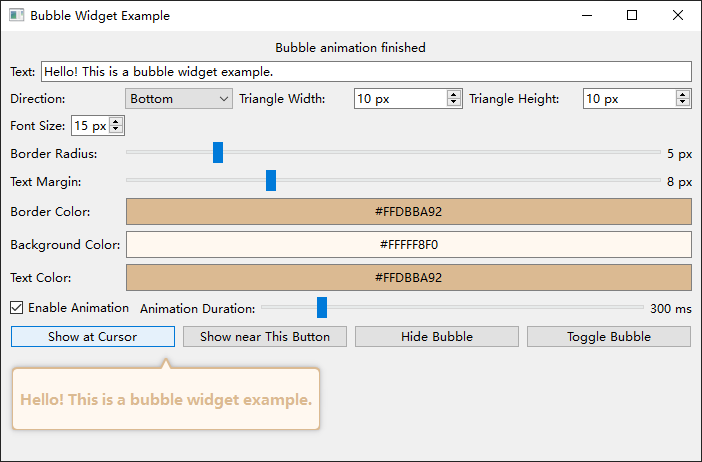

### [ButtonIconStateManager](src/ButtonIconStateManager/) - 按钮图标状态管理器

- 智能管理按钮在不同状态下的图标切换
- 支持正常、悬停、按下、选中四种状态
- 基于事件过滤器的自动状态检测
- 可应用于 QPushButton、QToolButton 等多种按钮类型

### [Carousel3DView](src/Carousel3DView/) - 3D轮播图控件

- 支持立体3D效果的图片轮播展示
- 可自定义动画持续时间和自动轮播间隔
- 鼠标悬停暂停自动轮播，移出后恢复
- 支持点击图片直接跳转到中心位置
- 响应式设计，适应不同窗口尺寸
- 提供完整的控制接口和状态反馈
- 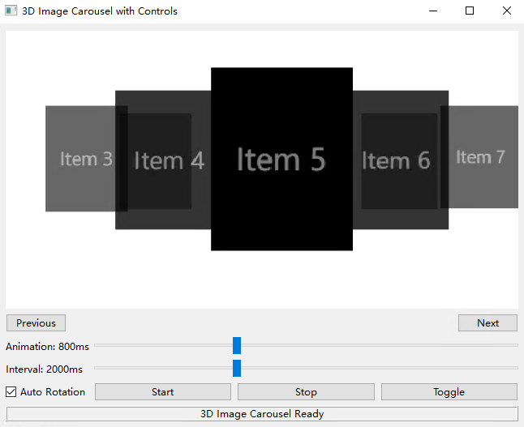

### [Chart](src/Chart/) - 数据可视化图表(QtCharts 模块 Desprecated)

- 多种图表类型：面积图、折线图、饼图、柱状图
- 实时动态图表
- 自定义标注和工具提示
- 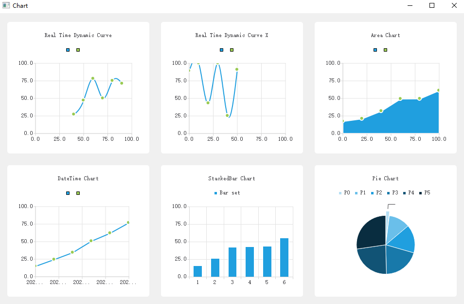
  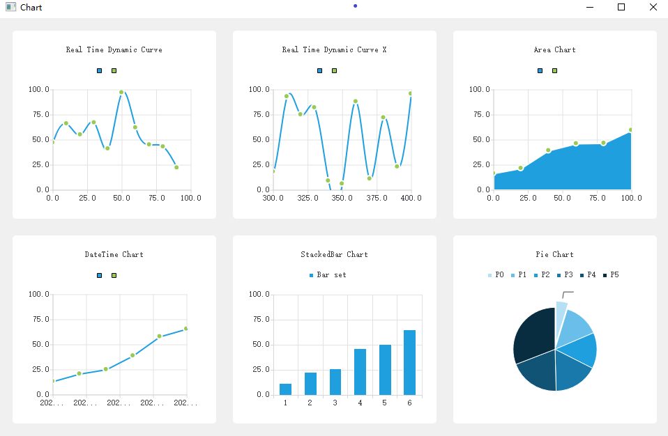

### [CheckableTreeItem](src/CheckableTreeItem/) - 层次化复选框树

- 父子节点复选框状态自动联动
- 支持三态显示（选中/未选中/部分选中）
- 包含文件系统树结构演示
- 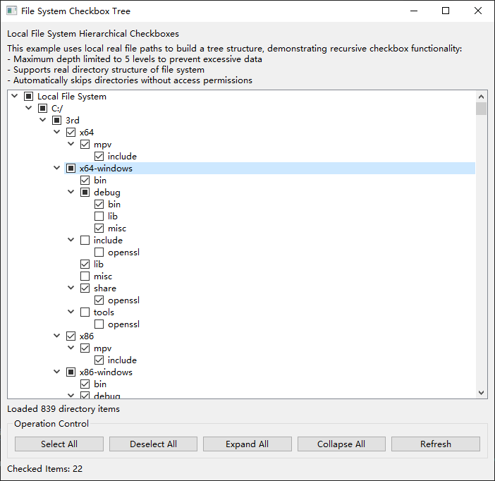

### [CircularProgress](src/CircularProgress/) - 圆形进度条控件

- 支持圆弧进度显示和百分比/数值显示
- 可自定义起始角度和结束角度
- 支持动画过渡效果和多种颜色定制
- 提供丰富的信号和槽函数用于状态监控
- 包含快速主题切换功能（经典、暗色、现代）
- 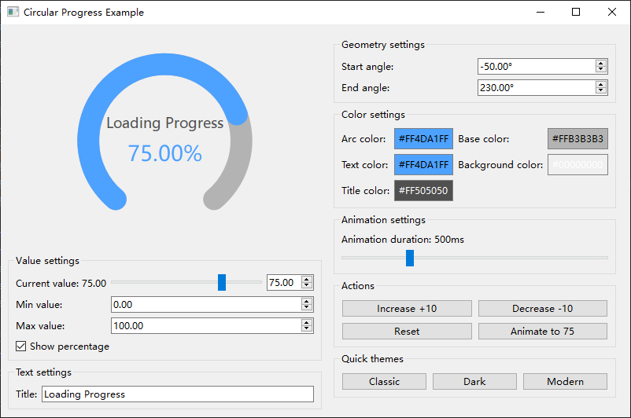

### [CircularProgressQuick](src/CircularProgressQuick/) - 圆形进度条控件（QtQuick版本）

- 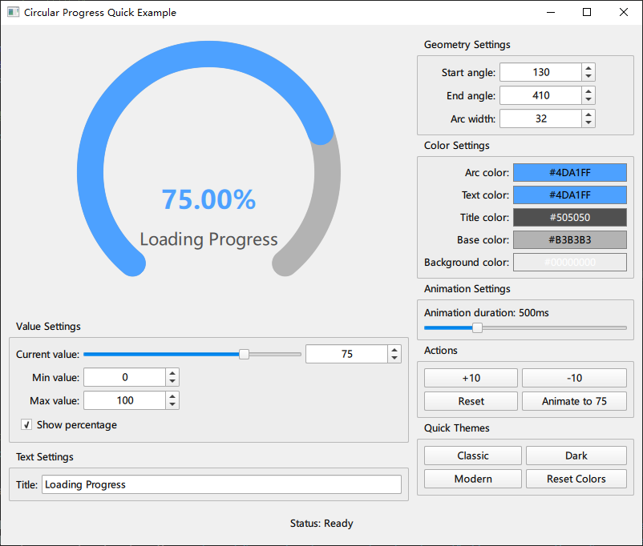

### [Clock](src/Clock/) - 模拟时钟控件

- 支持秒针平滑动画效果
- 可自定义表盘、刻度、指针颜色
- 提供多种预设颜色主题
- 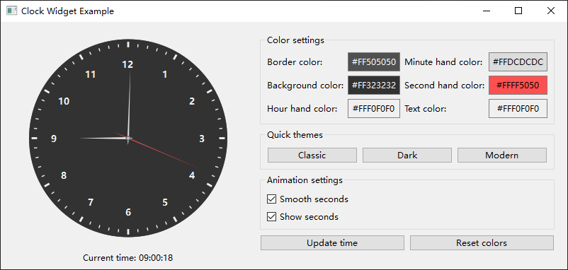

### [ClockQuick](src/ClockQuick/) - 模拟时钟控件（QtQuick版本）

- 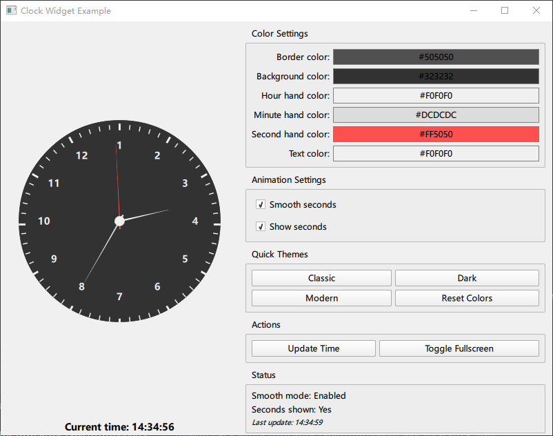

### [DashBoard](src/DashBoard/) - 仪表盘控件

- 可调节刻度范围和角度区间
- 支持指针数值动画过渡
- 高度可定制的颜色和文本样式
- 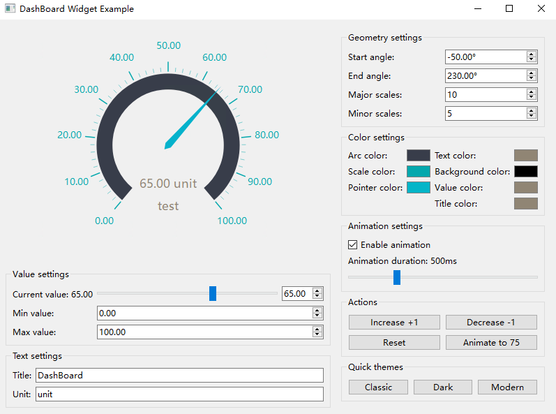

### [DashBoardQuick](src/DashBoardQuick/) - 仪表盘控件（QtQuick版本）

- 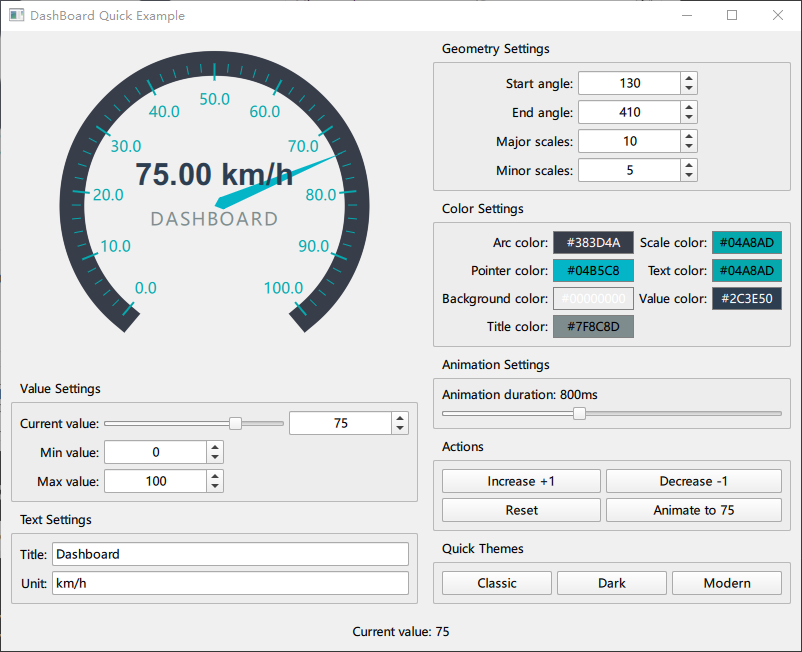

### [FlowLayout](https://doc.qt.io/qt-6/qtwidgets-layouts-flowlayout-example.html) - Qt 官方Flow Layout Example

### [GridViewModel](src/GridViewModel/) - 自适应网格布局

- 基于 Qt Model-View 架构的网格布局组件
- 支持自适应列数和自定义单元格
- 内置多选功能和流畅的交互体验
- 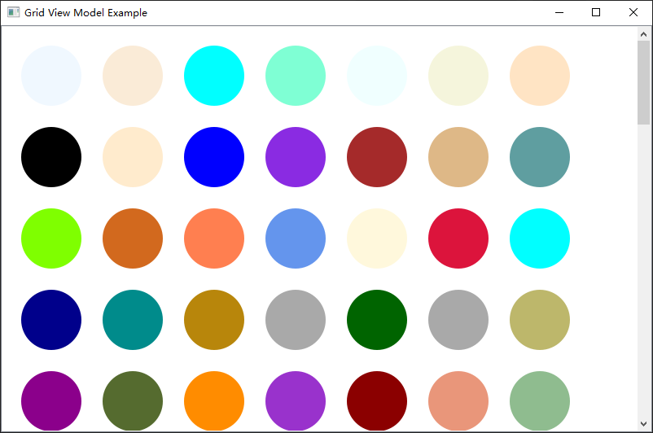

### [HttpClient](src/HttpClient/) - HTTP 客户端

- 支持GET/POST/PUT/DELETE方法
- 文件上传下载，支持断点续传和进度回调
- JSON请求和响应自动处理
- 超时控制和SSL证书配置
- 集成生命周期安全回调机制

### [LifecycleCallback](src/LifecycleCallback/) - 生命周期感知的回调包装器

- 自动检测对象销毁，避免悬空回调
- 支持QObject、std::shared_ptr和自由函数
- 类型安全，提供便捷创建函数
- 适用于异步操作和事件处理场景

### [LoadingIndicator](src/LoadingIndicator/) - 加载指示器控件

- 支持多种动画样式：旋转圆点、脉冲圆圈、跳动条形、自定义GIF动画
- 可自定义文本、颜色、背景和动画速度
- 提供覆盖模式，轻松实现遮罩加载效果
- 灵活的参数设置，适应不同场景需求
- 自动响应窗口尺寸变化，保持居中显示
- 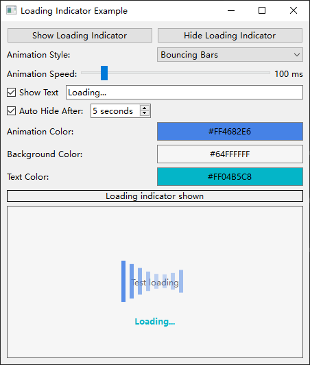

### [LoadingIndicatorQuick](src/LoadingIndicatorQuick/) - 加载指示器控件 (QtQuick版本)

- 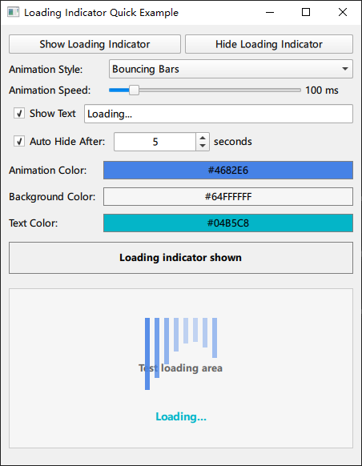

### [LoadingOverlayQuick](src/LoadingOverlayQuick/) - 加载覆盖层控件 (QtQuick版本)

- 基于QtQuick Popup的轻量级加载覆盖层组件
- 使用系统原生BusyIndicator，确保平台一致性
- 模态对话框设计，阻止用户交互
- 支持动态文本设置和颜色自定义
- 简洁API，提供show/hide方法控制显示
- 自动居中显示，适配不同屏幕尺寸
- 

### [LogAsync](https://github.com/RealChuan/Qt-App/blob/main/src/utils/logasync.h) - 异步日志记录系统

- 独立线程处理日志写入，避免阻塞主线程
- 支持控制台输出、文件记录或两者同时输出
- 按大小和时间自动滚动日志文件，支持自动清理旧文件
- 可设置不同日志级别（Debug、Info、Warning、Error、Fatal）
- 控制台输出长度限制，避免过长日志刷屏
- 内置信号槽机制，确保多线程环境下的数据安全

### [NavigationProgressBar](src/NavigationProgressBar/) - 导航进度条控件

- 支持多步骤流程可视化显示
- 可自定义颜色主题和字体样式
- 提供步骤前进、后退和重置功能
- 自适应布局，响应窗口尺寸变化
- 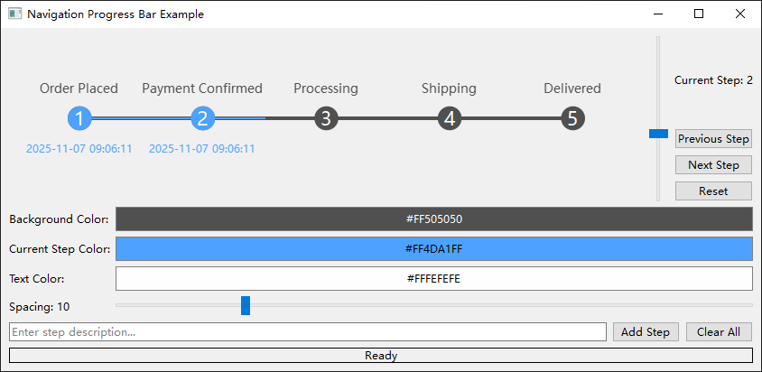

### [NavigationProgressBarQuick](src/NavigationProgressBarQuick/) - 导航进度条控件(QtQuick版本)

- 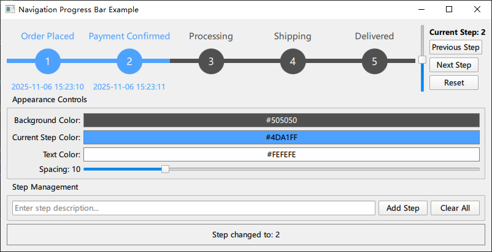

### [PasswordInputQuick](src/PasswordInputQuick/) - 密码输入框控件(QtQuick版本)

- 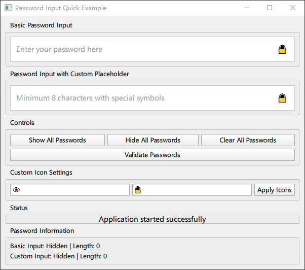

### [PasswordLineEdit](src/PasswordLineEdit/) - 密码输入框控件

- 支持显示/隐藏密码切换功能
- 自动检测CapsLock状态并显示警告提示
- 可自定义图标、提示时长和警告功能
- 提供密码验证和批量操作支持
- 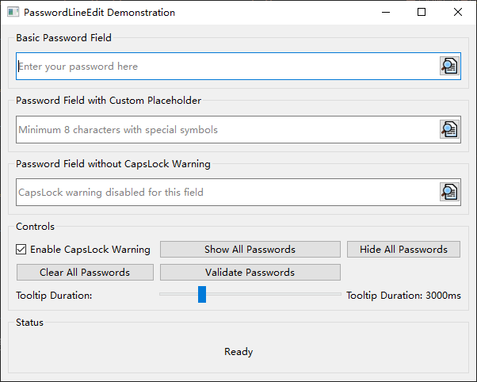

### [ProgressBar](src/ProgressBar/) - 线性进度条控件

- 支持动画过渡效果，可自定义动画时长
- 可自定义圆角半径，支持自动圆角计算
- 支持百分比和数值两种显示模式
- 提供丰富的颜色定制选项
- 包含完整的信号系统和便捷操作方法
- 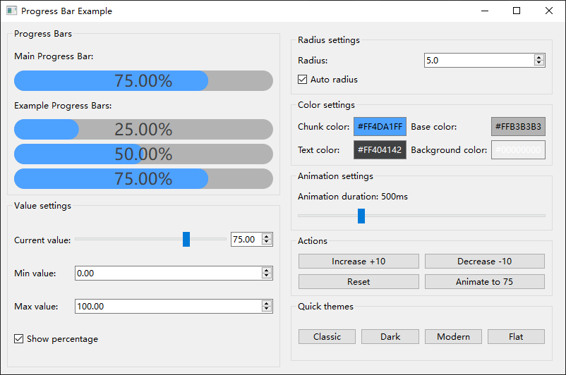

### [ReactorServer](src/ReactorServer/) - 多线程Reactor模式TCP服务器

- 基于Reactor设计模式的高性能TCP服务器框架
- 主从Reactor架构：主线程接受连接，工作线程处理I/O
- 内置线程池和负载均衡，自动分配连接到空闲线程
- 支持自定义连接回调，轻松扩展为Echo服务器或自定义协议服务器
- 使用生命周期安全的回调机制，确保线程安全和内存管理
- 提供完整的连接管理、状态监控和错误处理

### [SqliteWAL](src/SqliteWAL/) - SQLite 预写式日志

- 多线程 SQLite 数据库操作
- WAL 模式实现
- 线程安全写入操作

### [SwitchButton](src/SwitchButton/) - 开关按钮控件

- 支持平滑的开关动画过渡效果
- 可自定义选中和未选中状态的颜色
- 可自定义滑块颜色和边框颜色
- 支持鼠标悬停状态反馈
- 提供动画开始和完成的信号通知
- 响应式设计，适应不同尺寸
- 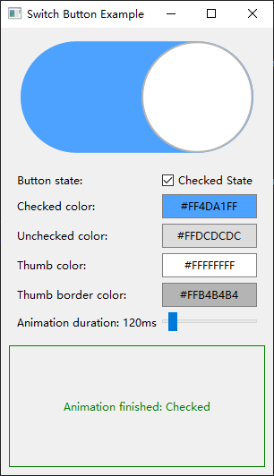

### [SwitchDelegate](https://doc.qt.io/qt-6/zh/qtquickcontrols-customize.html#customizing-switchdelegate) - Qt官方的开关按钮委托（QtQuick版本）

### [TableViewModel](src/TableViewModel/) - 高级表格视图

- 自定义委托：按钮、组合框、进度条
- 富文本渲染
- 星级评分委托
- 高性能数据渲染（10万+行）
- 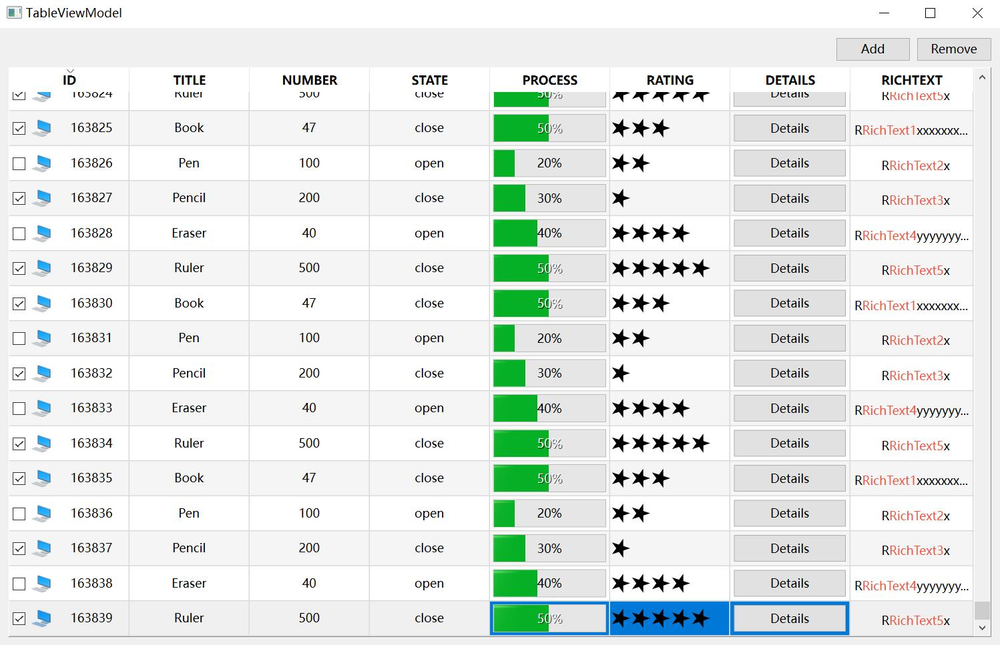

### [TreeViewModel](src/TreeViewModel/) - 树形和列表视图

- MVC 模式实现
- 复选框标题视图
- 类文件系统的树形结构
- 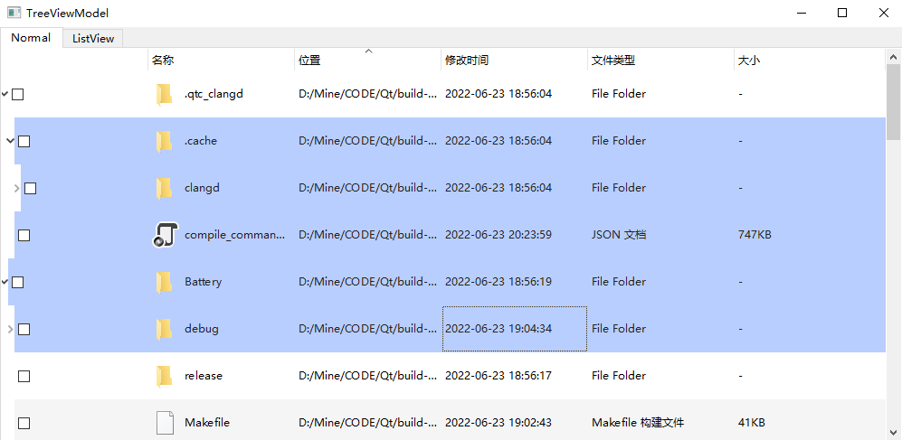
  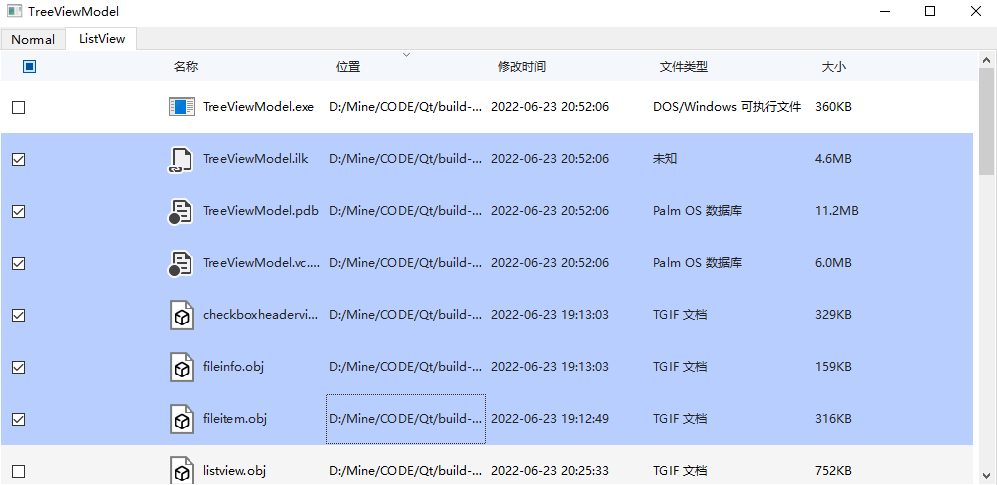

### [WindowsIntegration](src/WindowsIntegration/) - Windows"此电脑"集成

- **Windows**：注册表 `HKEY_CURRENT_USER\SOFTWARE\Classes\CLSID\{GUID}` 和 `HKEY_CURRENT_USER\SOFTWARE\Microsoft\Windows\CurrentVersion\Explorer\MyComputer\NameSpace\{GUID}`
- **功能**：将应用程序图标添加到Windows"此电脑"中，与磁盘驱动器并列显示
- **特点**：双击直接启动应用，使用应用自身图标，无需管理员权限
- 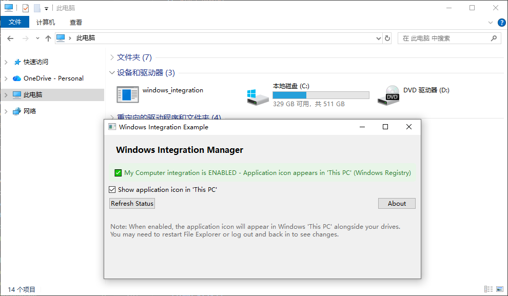

### [packaging](src/packaging/) - 跨平台打包解决方案

##### macOS 打包

- **参考实现**: [Qt-App macOS 打包](https://github.com/RealChuan/Qt-App/tree/main/packaging/macos)
- **核心文件**:
  - **DMG 打包**:
    - [create-dmg](https://github.com/sindresorhus/create-dmg)：最简单；
    - [create-dmg](https://github.com/create-dmg/create-dmg)：Bash 脚本；
    - [node-appdmg](https://github.com/LinusU/node-appdmg)：json 配置文件;
    - [dmgbuild](https://pypi.org/project/dmgbuild/)：Python 脚本;
  - [entitlements.plist](packaging/macos/entitlements.plist) - 应用程序签名权限配置文件
  - [package.sh](src/packaging/macos/package.sh) - 主要打包脚本，这里包含签名过程，[Qt-App macOS 打包](https://github.com/RealChuan/Qt-App/tree/main/packaging/macos)这里没有签名过程
  - [utils.sh](src/packaging/macos/utils.sh) - 打包辅助函数

##### Windows 打包

- **参考实现**: [Qt-App Windows 打包](https://github.com/RealChuan/Qt-App/tree/main/packaging/windows)
- **核心文件**:
  - [sign.bat](src/packaging/windows/sign.bat) - 代码签名脚本，支持集成到 Inno Setup
- **签名集成**: 将 sign.bat 中的签名脚本集成到 Inno Setup 工具：
  1. 在 Inno Setup 中选择 `Tools` → `Configure Sign Tools`
  2. 添加签名工具并粘贴 sign.bat 中的脚本内容
  3. 在打包脚本中为需要签名的文件添加对应的 sign flags 参数

##### Ubuntu 打包

- **参考实现**: [Qt-App Ubuntu 打包](https://github.com/RealChuan/Qt-App/tree/main/packaging/ubuntu)

## 资源

- [Qt 实用技巧（中文）](https://realchuan.github.io/2021/10/12/QT实用小技巧（想到就更新）/)
- [使用 QChart 显示实时动态曲线](https://qtdebug.com/qtbook-paint-realtime-curve-qchart/)
- [SQLite WAL 文档](https://sqlite.org/wal.html)
